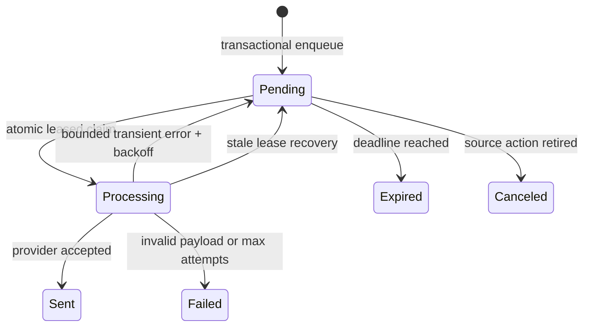

# Durable email delivery

Delivery telemetry includes bounded email type on per-job outcomes and provider
duration, enqueue-to-provider-acceptance duration, and pending/processing queue
depth and oldest age. Empty queues reset gauges to zero. Lost-lease updates do
not count as successful delivery transitions. Worker failures log a fixed event
without serializing database errors or encrypted payloads. Provider acceptance
still does not imply inbox delivery; bounce/complaint webhooks remain pending.

`@namera-ai/emails` owns a typed encrypted outbox, React Email templates, the
Resend provider adapter, and delivery processing. Domain workflows enqueue jobs
inside their existing transaction and never wait for the provider.

## Persistence

The complete `jobs.email_jobs` column definitions, uniqueness, attempt check,
and worker indexes are in the
[notification and jobs database catalog](../database/notifications-jobs.md#jobsemail_jobs).

## Payload security

The protocol owns a closed `EmailJobPayload` discriminated union. Enqueue
schema-encodes and AES-GCM encrypts the payload with version/key-ID metadata.
The worker decrypts and decodes again before rendering. Emails, magic-link
credentials, and template variables are never stored in plaintext job columns
or logs.

## Worker lifecycle

The worker retries up to five times with capped exponential backoff. Conditional
updates require the current lease token so stale workers cannot overwrite a
newer claim. Ciphertext is cleared after sent/failed/expired/canceled terminal
states.

## Templates and provider

Runtime React Email components live in `packages/emails/src/templates` and are
rendered directly by the Resend adapter. `apps/email-templates` is only a preview
harness and PNG asset generator. Templates use protocol-owned props, shared
Namera layout/theme primitives, responsive spacing, light/dark support, and CDN
PNG assets rather than embedded SVG.

API-key, session-key, account-creation and sign-in emails
include a dashboard action without a raw fallback URL. Only magic-link sign-in
emails include a copyable fallback URL. Application workflows build
links from `AUTH_DASHBOARD_PUBLIC_ORIGIN` through `/auth?returnTo=...`, preserving
the destination when sign-in is needed. Organization resources still require the
recipient to select the matching workspace; links never bypass authorization or
change workspace automatically. New `actionUrl` fields are optional when decoding
older queued payloads, which render without the added action. New producers always
populate them.

Execution confirmations are in-app only, regardless of email preferences. There
is no execution email payload, template or sending logic. The shared footer includes
the X profile with generated light/dark PNGs under `assets/email-assets/social/`.

Resend receives configured sender/reply-to, a bounded timeout, and the business
idempotency key. Development uses an explicit logger provider selected only when
`NODE_ENV=development`.

The `waitlist-confirmed` and `waitlist-accepted` payloads, subjects, runtime
templates and preview entries are implemented. Check their presentation in the
email preview; the server integration suite covers durable delivery. Confirmation
has no dynamic variables; acceptance requires `inviteCode`,
`invitationUrl` and `expiresAt`. The acceptance link uses the existing dashboard
`/auth?invite=...` flow. New waitlist joins enqueue confirmation atomically with
entry creation, with a one-day delivery deadline and no resend for duplicates.
Admin acceptance atomically queues the acceptance email with the seven-day
email-bound invite and completed transition.

## Pending

- Configure and verify the production sender domain, reply-to, and spam
  placement.
- Add provider webhooks, bounce/suppression state, and operator alerts.
- Define encryption-key rotation before multiple active key IDs are introduced.
