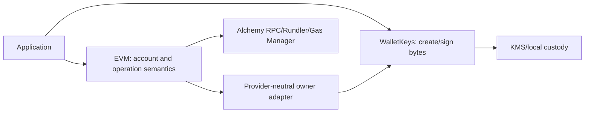

# Chain, custody, and cryptography packages

## `packages/crypto`

Crypto exposes purpose-separated primitives behind `CryptoService`: random tokens/codes/strings, hashes, HMAC/verification, SHA-256, and authenticated encryption/decryption. Domain code names a `cryptoPurpose` so the same raw value cannot be safely replayed across credential types.

Rules:

- Use platform `Crypto.Crypto`; provide Node implementation at server composition.
- Keep secrets in `Redacted` configuration.
- Compare credential digests through service operations appropriate to the primitive.
- Never log raw input, key material, ciphertext plaintext, or derived credentials.
- Reuse shared encoding helpers instead of creating local `TextEncoder` instances.

## `packages/wallet-keys`

Wallet Keys owns custody-provider implementations and exposes provider-neutral key creation/signing. Current adapters support local development files and Google Cloud KMS. Application receives public metadata and a signing operation, never raw provider clients/private keys.

Provider adapters own:

- key creation/import restrictions;
- algorithm/protection mapping;
- public-key normalization;
- payload signing and provider error mapping;
- provider locator data stored in `core.wallet_key.data`;
- test substitutes.

Adding a provider requires protocol-discriminated locator data, configuration/layer, creation/signing implementation, cleanup/compensation analysis, provider-boundary tests, and deployment IAM/runbook documentation.

## `packages/evm`

EVM owns the `eip155` adapter. Detailed architecture is in [the EVM hub](../evm/README.md). It uses provider-neutral owner accounts from Wallet Keys, reconstructs Kernel/Safe accounts, and contains all Viem/permissionless/provider-specific logic.

### Boundary between custody and chain code

Wallet Keys does not know Kernel, Safe, calls, UserOperations, or chain IDs. EVM does not know Google IAM/private-key files or persist provider secrets.

## Adding a namespace

1. Define namespace primitives, wallet data, operations, policies, and DTO union branches in protocol.
2. Create a dedicated adapter package with account construction, execution, signing/verification, and policy service interfaces matching application needs.
3. Extend application dispatch at deliberate namespace boundaries.
4. Keep database JSONB models discriminated; avoid namespace-specific columns unless query requirements justify them.
5. Add SDK/CLI/MCP/dashboard namespace presentation and input decoding.
6. Add provider test layers and full boundary tests.

## Pending before production

- Complete KMS IAM/key lifecycle/rotation and orphan cleanup runbooks.
- Define production local-provider prohibition or explicit secure deployment constraints.
- Add cryptographic known-answer and provider signature-format regression suites.
