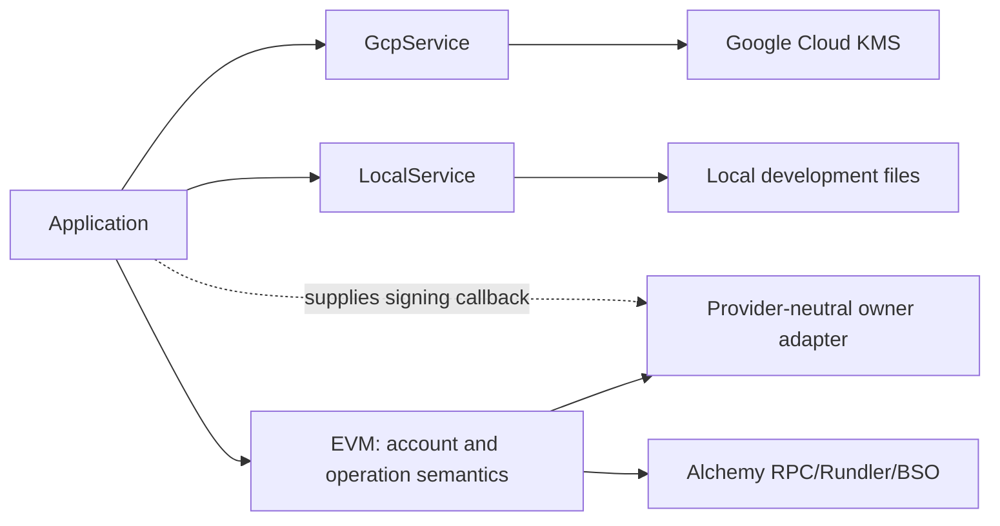

# Chain, custody, and cryptography packages

## `packages/crypto`

Crypto exposes purpose-separated primitives behind `CryptoService`: random tokens/codes/strings, hashes, HMAC/verification, SHA-256, and authenticated encryption/decryption. Domain code names a `cryptoPurpose` so the same raw value cannot be safely replayed across credential types.

Rules:

- Use platform `Crypto.Crypto`; provide Node implementation at server composition.
- Keep secrets in `Redacted` configuration.
- Compare credential digests through service operations appropriate to the primitive.
- Never log raw input, key material, ciphertext plaintext, or derived credentials.
- Reuse shared encoding helpers instead of creating local `TextEncoder` instances.

## `packages/wallet-providers/*`

Independent GCP and local packages expose `GcpService` and `LocalService`. Each owns its operation schemas, errors, configuration and test layer. Application calls the explicit provider and supplies signing callbacks to EVM; no shared provider interface or registry is used. Provider clients/private keys stay inside the owning package. A future OneClawService can expose provider-specific capabilities without conforming to a universal lifecycle.

The server installs both provider-specific disabled layers in every environment. Public
wallets use browser passkeys, and routine session execution/signing uses local
client keys. The adapters below remain internal package capabilities.

Provider adapters own:

- key creation/import restrictions;
- algorithm/protection mapping;
- public-key normalization;
- payload signing and provider error mapping;
- provider locator data stored in `core.signing_key.data`;
- test substitutes.

Adding a provider requires protocol-discriminated locator data, configuration/layer, creation/signing implementation, cleanup/compensation analysis, provider-boundary tests, and deployment IAM/runbook documentation.

## `packages/evm`

EVM owns the `eip155` adapter. Detailed architecture is in [the EVM hub](../evm/README.md). It reconstructs Alchemy Modular Account V2 from public account and installation data and contains Viem/Alchemy-specific logic. Managed owner adapters are internal capabilities; public execution uses detached local signatures.

### Internal managed-provider boundary

Provider services do not know Modular Account V2, calls, UserOperations, or chain IDs. EVM does not know Google IAM/private-key files or persist provider secrets.

## Adding a namespace

1. Define namespace primitives, wallet data, operations, policies, and DTO union branches in protocol.
2. Create a dedicated adapter package with account construction, execution, signing/verification, and policy service interfaces matching application needs.
3. Extend application dispatch at deliberate namespace boundaries.
4. Keep database JSONB models discriminated; avoid namespace-specific columns unless query requirements justify them.
5. Add SDK/CLI/MCP/dashboard namespace presentation and input decoding.
6. Add provider test layers and full boundary tests.
