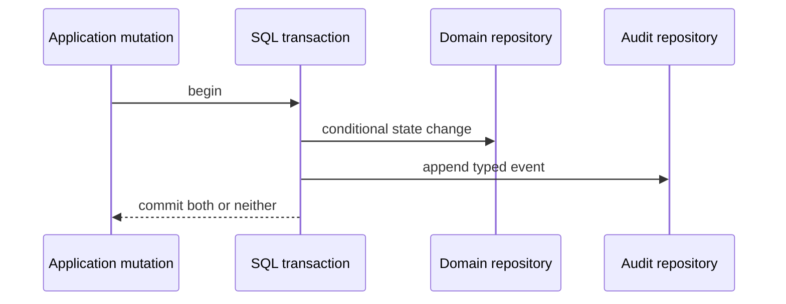

# Audit events

Audit events preserve typed historical context for successful state changes.
They are distinct from logs: audit data is queryable product history, while logs
describe operational transitions.

## Persistence

The `audit.user_events`, `audit.organization_events`, `audit.platform_events`,
`audit.beta_invite_events`, and `audit.waitlist_events` column,
foreign-key, check, and index definitions are in the
[audit database catalog](../database/audit.md).

## Write contract

The internal Audit service adds source and active correlation context. Failed
mutations and reads are not audited. Idempotent no-op mutations do not append a
duplicate event. Current event families cover user/sign-in/session,
organization/member/invitation, wallet, API key, OAuth authorization, session
key, execution, signature, and beta-invite lifecycle transitions. Beta-invite
events retain a separate ID-only journal. Operator mutations also append
platform events attributed to the authenticated platform member in the same
transaction; see [admin authorization](../auth/admin.md). Bootstrap events may
have no acting member.

Events exclude credentials, raw signed content where not required, signatures,
arbitrary provider errors, and complete transaction call payloads.
