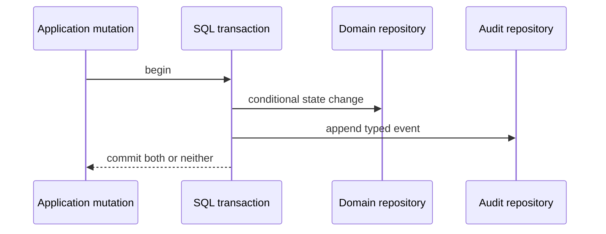

# Audit events

Audit events preserve typed historical context for successful state changes.
They are distinct from logs: audit data is queryable product history, while logs
describe operational transitions.

## Tables

### `audit.user_events`

| Column group                                        | Meaning                                                   |
| --------------------------------------------------- | --------------------------------------------------------- |
| `id`, `user_id`, optional `session_id`              | Event identity and user scope.                            |
| `event`, `source`, `data`                           | Versioned event discriminator, origin, and typed payload. |
| `correlation_id`, optional `request_id`, `trace_id` | Cross-boundary correlation.                               |
| `created_at`                                        | Immutable event time.                                     |

Indexes support newest-first user history, event filtering, session history, and
correlation lookup.

### `audit.organization_events`

Adds `organization_id`, optional organization actor, and an optional
`resource_type`/`resource_id` pair. A check requires both resource fields or
neither. A composite foreign key proves actor ownership by the organization.
Indexes cover organization time, event type, actor, resource, and correlation.

## Write contract

The internal Audit service adds source and active correlation context. Failed
mutations and reads are not audited. Idempotent no-op mutations do not append a
duplicate event. Current event families cover user/sign-in/session,
organization/member/invitation, wallet, API key, OAuth authorization, session
key, execution, and signature lifecycle transitions.

Events exclude credentials, raw signed content where not required, signatures,
arbitrary provider errors, and complete transaction call payloads.

## Pending

- Add cursor-paginated application/API reads for user and organization history.
- Add and enforce an `audit:read` organization permission.
- Add dashboard history surfaces.
- Populate request IDs after a bounded server request-ID context is introduced;
  trace IDs are already captured from the active Effect span.
