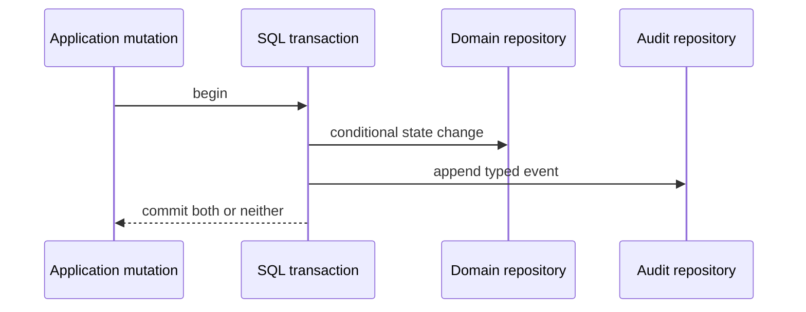

# Audit events

Audit events preserve typed historical context for successful state changes.
They are distinct from logs: audit data is queryable product history, while logs
describe operational transitions.

## Persistence

The complete `audit.user_events`, `audit.organization_events`, and `audit.beta_invite_events` column,
foreign-key, check, and index definitions are in the
[audit database catalog](../database/audit.md).

## Write contract

The internal Audit service adds source and active correlation context. Failed
mutations and reads are not audited. Idempotent no-op mutations do not append a
duplicate event. Current event families cover user/sign-in/session,
organization/member/invitation, wallet, API key, OAuth authorization, session
key, execution, signature, and beta-invite lifecycle transitions. Beta-invite
events use a separate ID-only journal because issuance and revocation use an
operator credential rather than a tenant actor; see [beta admission](../auth/core/beta-invites.md).

Events exclude credentials, raw signed content where not required, signatures,
arbitrary provider errors, and complete transaction call payloads.

## Pending

- Add cursor-paginated application/API reads for user and organization history.
- Add and enforce an `audit:read` organization permission.
- Add dashboard history surfaces.
- Populate request IDs after a bounded server request-ID context is introduced;
  trace IDs are already captured from the active Effect span.
