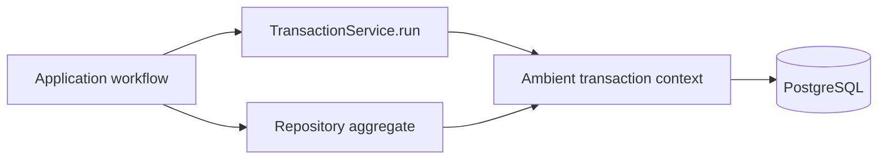

# Database architecture

Namera uses PostgreSQL through Drizzle and Effect SQL. Schemas separate product
domains while repositories expose transaction-aware operations to application
workflows. Migrations are applied by the server under a PostgreSQL advisory lock
before the HTTP port opens.

Effect SQL rc.117 uses its native PostgreSQL driver. Drizzle owns the SQL casts
and decoding for dates/timestamps; the old node-postgres `getTypeParser` override
is no longer part of the driver configuration. Verify driver upgrades in the
disposable PostgreSQL lane, not just PGlite.

## Logical schemas

| Schema         | Tables                                                                                                                                             | Responsibility                                                          |
| -------------- | -------------------------------------------------------------------------------------------------------------------------------------------------- | ----------------------------------------------------------------------- |
| `auth`         | users, accounts, verifications, sessions, actors, organizations, roles, members, invitations, OAuth tables, API keys                               | Identity, tenants, management authorization, and delegated credentials. |
| `core`         | signing keys, legacy wallet keys, wallets, session keys, grants, policy state/reservations, execution submissions/executions, signature operations | Wallet resources and operation ledgers.                                 |
| `billing`      | accounts, subscriptions, provider events                                                                                                           | Organization entitlements and future provider synchronization.          |
| `notification` | notifications, recipients, preferences                                                                                                             | Immutable occurrences, inbox state, and delivery preferences.           |
| `jobs`         | email jobs                                                                                                                                         | Encrypted transactional email outbox.                                   |
| `audit`        | user events, organization events                                                                                                                   | Append-only typed history.                                              |

## Tenant integrity

Organization-owned resources use composite identities and foreign keys such as
`(resource_id, organization_id)`. Dependent records repeat `organization_id`
where necessary so PostgreSQL, not only application code, rejects cross-tenant
links. Examples include:

- member actor and role references;
- API-key creator and revoker actors;
- wallet to root signing key;
- session key to wallet and creator;
- grants to actor and session key;
- execution/signature operations to actors, grants, keys, and wallets;
- organization audit events to actors.

Soft lifecycle history uses partial uniqueness. There may be only one active
membership for an organization/user, one pending invitation for an
organization/email, one active grant for an actor/session-key pair, and one
current subscription per organization while historical rows remain queryable.

## Repository and transaction model

Repository methods work against either the normal database service or the
ambient transaction installed by `TransactionService.run`. Public repository
interfaces never accept a raw transaction client. Repositories own SQL,
conditional transitions, row locking, cursor pagination, and persistence
decoding; application workflows own authorization and business decisions.

## ID and time conventions

- Application and schema defaults use UUIDv7-compatible text IDs for sortable
  identities.
- Timestamps use timezone-aware PostgreSQL values.
- Lifecycle mutations are conditional on the expected status so concurrent
  requests converge without duplicating side effects.
- Cursor lists order by a stable timestamp plus ID where necessary.
- JSONB stores namespace- or provider-discriminated data decoded through Effect
  Schema at the persistence boundary.

## Migration and test lifecycle

The server applies the full migration chain before role synchronization and
worker startup. Tests use the same migrations with PGlite, load the bundled
`pg_trgm` extension required by address-metadata search indexes, and delete
tables in foreign-key order between cases. PGlite verifies migration and normal
repository compatibility; PostgreSQL remains required for advisory locks,
concurrency, and query-plan verification. The pre-production database is
disposable; current migrations optimize for a clean initial deployment rather
than legacy backfills.

The opt-in server PostgreSQL lane uses `TestDatabase.postgresLayer(port)` and
the production driver/migrator, with the same reset ordering as PGlite. It is
restricted to a separate loopback port and the disposable `namera_test` database.
Only the driver's layer receives the live clock, keeping pool/socket lifetimes
independent of business-time jumps in tests. Application workflows still use
the test clock.
See [testing](../engineering/testing.md) for commands and coverage boundaries.

## Pending

- Rehearse the migration chain against the exact production PostgreSQL version.
- Define retention jobs for expired authentication, OAuth, invitation, session,
  and terminal operation records.
- Add query-plan checks for high-volume execution, audit, notification, and
  OAuth-token lookup paths before production traffic grows.
