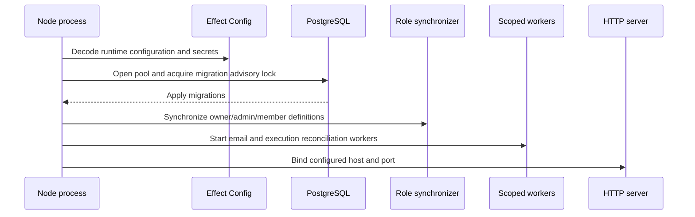

# Server runtime

`apps/server` is the only live composition root. It binds the Node HTTP server,
loads configuration, selects providers, applies migrations, starts scoped
workers, and mounts typed HTTP and MCP transports.

## Startup

Effect scopes close the server, workers, provider clients, exporters, and
database resources during shutdown.

## Layer composition

The live graph includes PostgreSQL repositories and transactions, Node Crypto,
the encrypted EmailJobs service, the selected email provider, selected
WalletKeys provider, EVM clients, application workflows, route handlers, and
telemetry. Provider selection is environment-owned:

- wallet keys: disabled in every server environment for the self-custodial beta;
- email: development logger in development, Resend otherwise;
- telemetry: local LGTM outside production, Axiom datasets in production.

## HTTP boundaries

- The generated Effect `HttpApi` serves typed application routes.
- OAuth protocol routes handle form media types and protocol-specific error
  responses directly where the generated JSON API is not appropriate.
- MCP transport runs in the CLI loopback listener, not the API. OAuth consent,
  token issuance and authorization management remain on the API.
- `/rpc/eip155/:chainId` proxies validated EVM JSON-RPC to Alchemy.
- `/t/{traces,logs,metrics}/v1` proxies browser OTLP without exposing provider
  credentials.
- `/health` is the process readiness/liveness endpoint; `/reference` serves the
  Scalar contract reference.

Credentialed CORS allows one configured dashboard origin. Cookies, actor
authentication, permission narrowing, DTO mapping, rate limiting, and transport
error mapping live in server adapters rather than application workflows.

The outer security middleware sets `nosniff`, frame denial, no-referrer, and
defaults responses to `Cache-Control: no-store` before authentication or routing.
Successful public OAuth discovery responses retain their explicit cache policy;
all error responses use no-store. Status, cookies, and redirect locations are
preserved. Dashboard document CSP and WebAuthn permissions belong to its origin.

## Workers

### Email delivery

Claims due jobs with leases, decrypts and decodes the typed payload, sends via
the provider, and conditionally marks sent, retryable, expired, or failed.

### Execution reconciliation

Claims prepared or submitted execution rows with leases, checks bundler status
and receipts with bounded concurrency, retries uncertain states, and calls the
same application settlement/release path used by the synchronous request.

Idle polling is intentionally untraced. A span starts after work is claimed.

## Rate limiting

The current Effect store is process-local. Global IP and focused limits protect
magic links, invitations, API-key creation, OAuth/device flow, MCP, execution,
signatures, RPC, and telemetry proxy traffic. Actor- or authorization-scoped
limits supplement IP limits where appropriate.

Before transport limits, the client-address middleware trusts sanitized ingress
headers unconditionally. This requires ingress to overwrite
`X-Real-IP` and `X-Forwarded-For` and prevent direct origin access. It prefers a
valid `X-Real-IP`, otherwise uses the first address in a valid `X-Forwarded-For`
chain, without a CIDR allowlist. Invalid/missing headers fall back to the socket.
There are no environment switches, proxy CIDRs, or range checks. Canonicalized
IPs populate the request's remote address for limits and downstream request
metadata. Transport tests cover malformed/over-32-hop chains, IPv6 normalization,
sanitized-header precedence/fallback, absent socket addresses, and
separate rate-limit buckets behind one proxy for both supported headers.

## Deployment

`apps/server/Dockerfile` builds the server-only production image from the repository
root. The manual `deploy-server.yml` workflow calls `build-and-push.yml` with app
name `namera-server`, pushes to Artifact Registry, and dispatches the image tag to
`thenamespace/infra`, which owns Helm values and ArgoCD deployment. Server secrets
are supplied at runtime, not baked into the image.

## Pending

- Replace the process-local limiter with an atomic shared store before running
  multiple server replicas.
- Verify the deployed ingress overwrites both client-IP headers, blocks direct
  origin access, and resolves distinct client IPs.
- Add worker-liveness and queue-age alerts.
