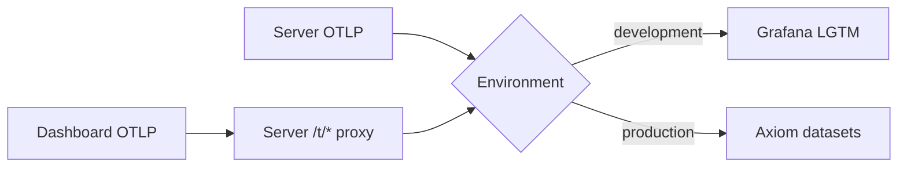

# Telemetry

Namera emits Effect traces, structured logs, and metrics through OTLP.
`@namera-ai/telemetry` owns exporters, service identities, route normalization,
and metric definitions. Feature packages remain vendor-neutral.

## Export topology

Production uses separate trace, log, and metric datasets with a redacted Axiom
token. The browser only knows server proxy paths. Proxy requests are content-
type checked, body bounded, timed out, rate limited, and untraced.

## Traces

- Trace HTTP, application workflows, repositories, SQL transactions, and
  external providers when they explain meaningful work.
- Use stable names such as `http.server POST /wallets`, never raw identifiers or
  query strings.
- Project span namespaces are lowercase owning boundaries: `server.*`,
  `application.*`, `database.*`, `emails.*`, `wallet-keys.*`, and `evm.*`.
- Repository spans are the normal database detail boundary. Low-level Drizzle
  and SQL-execute spans stay suppressed to avoid duplication.
- Context lookup, decoding, field construction, cryptographic primitives, idle
  worker polls, current-session probes, and OTLP forwarding are untraced.

## Logs

Emit one event message with structured snake-case annotations. Log only concise
decisions or lifecycle transitions. Never log credentials, email addresses,
signed messages, transaction calls, signatures, arbitrary payloads, raw URLs,
or unbounded error text. Development-only providers may expose local test values
only where their package README states that behavior.

## Metrics

Definitions live in `packages/telemetry/src/metrics`. The owning workflow
updates them at the boundary that knows the result. Use counters for
occurrences, timers for duration, and bounded frequency values for outcomes.

Safe dimensions include route template, method, status class, provider,
namespace, implementation, protection level, actor type, policy type, and
closed result codes. IDs, IP/email addresses, arbitrary URLs, and failure
messages are prohibited metric labels.

HTTP metrics exclude `/t/*` to prevent an exporter feedback loop. No-op
mutations do not increment successful mutation metrics.

### Billing signals

| Metric                              | Bounded attributes  | Meaning                                     |
| ----------------------------------- | ------------------- | ------------------------------------------- |
| `namera.billing.meter.transitions`  | `meter`, `outcome`  | Reserve/reuse/deny/settle/release attempts. |
| `namera.billing.period.rollovers`   | —                   | Anniversary periods created.                |
| `namera.billing.recovery.results`   | `source`, `outcome` | Expired holds recovered or safely deferred. |
| `namera.billing.projection.repairs` | `meter`             | Ledger-derived balance repairs.             |

The immutable usage ledger and meter balances remain the accounting truth;
metrics are operational signals and may reflect an attempted transition that
is later rolled back by a wider domain transaction. The billing worker logs
only nonzero aggregate run counts and one bounded failure event.

### Dashboard signals

| Metric                                    | Bounded attributes | Meaning                                  |
| ----------------------------------------- | ------------------ | ---------------------------------------- |
| `namera.dashboard.overview.reads`         | —                  | Successful organization overview reads.  |
| `namera.dashboard.overview.read.duration` | —                  | End-to-end overview aggregation latency. |

The overview is a read projection assembled from billing, resource, operation,
and recent-execution queries. It emits no identifiers or organization-specific
labels.

## Runtime variables

| Variable                      | Use                                |
| ----------------------------- | ---------------------------------- |
| `NODE_ENV`                    | Select local or production export. |
| `TELEMETRY_SERVICE_VERSION`   | Resource service version.          |
| `OTEL_EXPORTER_OTLP_ENDPOINT` | Local LGTM OTLP/HTTP base.         |
| `AXIOM_API_TOKEN`             | Production ingestion credential.   |
| `AXIOM_OTLP_BASE_URL`         | Axiom base endpoint.               |
| `AXIOM_TRACES_DATASET`        | Trace dataset.                     |
| `AXIOM_LOGS_DATASET`          | Log dataset.                       |
| `AXIOM_METRICS_DATASET`       | Metric dataset.                    |

## Verification

After instrumentation changes, inspect one read and one mutation. Confirm one
cross-service trace, stable route names, bounded metric attributes, structured
log fields with trace correlation, no `/t/*` trace loop, and no idle-worker or
helper-only roots.

## Pending

- Define production alerts and operational dashboards for HTTP failures and
  latency, worker age, provider errors, authorization changes, database
  saturation, rate-limit rejections, and OTLP export failures.
