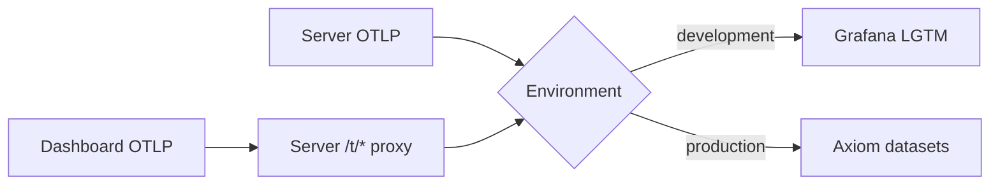

# Telemetry

Namera emits Effect traces, structured logs, and metrics through OTLP.
`@namera-ai/telemetry` owns exporters, service identities, route normalization,
and metric definitions. Feature packages remain vendor-neutral.

## Export topology

Production uses separate trace, log, and metric datasets with a redacted Axiom
token. The browser only knows server proxy paths. Proxy requests are content-
type checked, body bounded, timed out, rate limited, and untraced.

The admin portal uses the same browser exporter/runtime pattern, with service
identity `namera-admin-portal` and normalized HTTP span names. `/internal/me`
probes are untraced. The three `/t/*/v1` endpoints accept non-credentialed POSTs
from only the configured dashboard and admin origins; landing and arbitrary origins
are not admitted by CORS. Browser tests disable exporters. Existing server workflow
spans and transactional platform audit events remain authoritative for team changes.

## Traces

Google callback paths are excluded from automatic HTTP tracing even with query
strings, and the provider exchange suppresses HTTP tracing. Safe application
spans and bounded auth metrics remain; OAuth codes, state and tokens must not
appear in trace attributes. See [Google authentication](../auth/core/google.md).

- Trace HTTP, application workflows, repositories, SQL transactions, and
  external providers when they explain meaningful work.
- Use stable names such as `http.server POST /wallets`, never raw identifiers or
  query strings.
- Project span namespaces are lowercase owning boundaries: `server.*`,
  `application.*`, `database.*`, `emails.*`, `wallet-keys.*`, and `evm.*`.
- Repository spans are the normal database detail boundary. Low-level Drizzle
  and SQL-execute spans stay suppressed to avoid duplication.
- Context lookup, decoding, field construction, cryptographic primitives, idle
  worker polls, current-session probes, and OTLP forwarding are untraced.

## Logs

HTTP spans retain Effect's `client.address` socket peer. The trusted-proxy
middleware adds `namera.client.address` for the resolved rate-limit identity and
`namera.client.ip_source` (`socket` or `forwarded`) to verify ingress behavior.
Client IPs are not metric labels or additional log fields. Treat these trace
attributes as personal data under the deployment's access and retention policy.

Emit one event message with structured snake-case annotations. Log only concise
decisions or lifecycle transitions. Never log credentials, email addresses,
signed messages, transaction calls, signatures, arbitrary payloads, raw URLs,
or unbounded error text. Development-only providers may expose local test values
only where their package README states that behavior.

Execution and billing recovery emit fixed failure events, never raw error
objects. Per-submission recovery retains the submission ID and a code-owned
retry reason for diagnosis; database/provider causes may include confidential
query parameters or signed envelopes and must not be serialized into those logs.
After 24 hours, unresolved execution recovery emits a warning at its five-minute
read-only retry cadence and records `result=unresolved` on the reconciliation
counter. This distinguishes investigation-needed attempts from normal retries.

## Metrics

Definitions live in `packages/telemetry/src/metrics`. The owning workflow
updates them at the boundary that knows the result. Use counters for
occurrences, timers for duration, and bounded frequency values for outcomes.

Safe dimensions include route template, method, status class, provider,
namespace, implementation, protection level, actor type, policy type, and
closed result codes. IDs, IP/email addresses, arbitrary URLs, and failure
messages are prohibited metric labels.

HTTP metrics exclude `/t/*` to prevent an exporter feedback loop. No-op
mutations do not increment successful mutation metrics.

Metrics export cumulative snapshots every 60 seconds in the server, dashboard,
and admin portal, independently of trace batching (one second in browsers, ten
seconds on the server) and log batching (one second). No signal or instrumented
observation is sampled out by this cadence change: counters and histograms
aggregate between exports. Gauges represent their value at collection time.
Unchanged metrics may still be sent while idle. Use metric chart intervals of
at least one minute. Normal scoped shutdown retains the exporter's final flush;
abrupt browser termination can lose observations since the last export.

Exporters transport existing instrumentation; they do not automatically record
all clicks, uncaught browser errors, or stack traces. Explicit diagnostic events
must follow the same privacy and bounded-attribute rules. Fast trace/log export
remains enabled for existing browser workflows. Cadence regression tests exercise
all three signals with a test clock and captured OTLP requests.

CLI-local MCP tools create `cli.mcp.tool` spans without payloads using Effect.
The CLI has no telemetry-package dependency, counter, or configured exporter;
it does not automatically send telemetry from the user's machine. The API no
longer hosts MCP tools.

### Billing signals

| Metric                              | Bounded attributes  | Meaning                                     |
| ----------------------------------- | ------------------- | ------------------------------------------- |
| `namera.billing.meter.transitions`  | `meter`, `outcome`  | Reserve/reuse/deny/settle/release attempts. |
| `namera.billing.period.rollovers`   | —                   | Anniversary periods created.                |
| `namera.billing.recovery.results`   | `source`, `outcome` | Expired holds recovered or safely deferred. |
| `namera.billing.projection.repairs` | `meter`             | Ledger-derived balance repairs.             |

The immutable usage ledger and meter balances remain the accounting truth;
metrics are operational signals and may reflect an attempted transition that
is later rolled back by a wider domain transaction. The billing worker logs
only nonzero aggregate run counts and one bounded failure event.

Sponsored-gas reconciliation uses `sponsorship_settled` and
`sponsorship_deferred` outcomes on the existing recovery counter. Provider
lookup warnings include only a closed reason code; no credential, HTTP response
or signed envelope is logged. Costs exceeding a hold emit a warning with the
reservation ID for operator investigation (never a metric label). Missing cost
records remain normal deferred work.

### Waitlist signals

`namera.waitlist.joins` counts new entries only, excluding duplicate joins.
The legacy status-change counter and management route labels are removed.
Retired routes resolve to `/*`, so emails and IDs never become metric attributes.
See [waitlist](../auth/waitlist.md) for coverage and deployment boundaries.

### Dashboard signals

Owner session operations expose `namera.session_key.operation.results` with
bounded `stage` (`prepare`, `approve`) and `result` (transition or protocol error
code), plus `namera.session_key.operation.duration` tagged by stage. Replayed
successful requests do not increment transition counts. As with billing,
transaction-scoped metrics can describe an attempt subsequently rolled back.

| Metric                                    | Bounded attributes | Meaning                                  |
| ----------------------------------------- | ------------------ | ---------------------------------------- |
| `namera.dashboard.overview.reads`         | —                  | Successful organization overview reads.  |
| `namera.dashboard.overview.read.duration` | —                  | End-to-end overview aggregation latency. |

The overview is a read projection assembled from resource, operation-total, and
operation-activity queries. It emits no identifiers or organization-specific
labels.

### Workflow and worker coverage

- HTTP templates cover the typed API, raw OAuth endpoints and proxy routes.
  A contract-reflection regression test guards new typed routes against falling
  into `/*`. Unknown paths still use that bounded fallback.
- Beta invite `namera.beta_invite.transitions` records committed `redeemed`
  transitions. The retired issuance/revocation workflows no longer emit metrics.
  Organization invitation failures carry only a bounded action and error code.
- Execution request results and duration carry `stage=prepare|complete|simulate`.
  These count requests (including replay), not unique submissions. Policy
  decisions distinguish preparation from read-only simulation. Signature failure
  results carry their prepare/complete stage and typed error code.
- `namera.auth.authentication.results` distinguishes session, API-key and bearer
  credential success/invalid outcomes before the downstream handler runs.
  Missing credentials rejected by the transport remain visible in HTTP status
  metrics. `namera.http.rate_limit.rejections` uses code-owned limiter scopes.
- Email delivery counters and provider duration include email type. Bulk expiry
  remains an aggregate without type. `namera.email.jobs.time_to_send` measures
  enqueue-to-provider-acceptance latency, not inbox delivery. Lease-losing
  completion attempts do not increment successful delivery counters.
- All four workers emit `namera.worker.poll.results` and
  `namera.worker.last_success` (Unix seconds). A successful poll does not mean
  every claimed job succeeded. Alert on failures and stale last-success values.
- Email, execution and session-operation polls report `namera.worker.backlog`
  and `namera.worker.oldest_age` (seconds). Execution includes signed prepared
  and submitted attempts; session operations include signed/submitted attempts;
  email includes pending/processing jobs, including scheduled retries. Unsigned
  owner approvals and unsigned execution reservations are not queue backlog.
  Gauges reset to zero for empty queues. These are global database snapshots:
  use the latest/max across replicas, never sum replicas. Existing status-led
  indexes support the filters; verify aggregate cost as history grows.
- Execution/session-operation orchestration and idle claim/expiry queries are
  untraced; claimed work retains per-item spans. Worker failures use fixed log
  messages, not raw database/provider errors.

New signals require deployment before Axiom receives them. Local changes are
not a claim of successful production ingestion or verification.

## Runtime variables

| Variable                      | Use                                |
| ----------------------------- | ---------------------------------- |
| `NODE_ENV`                    | Select local or production export. |
| `TELEMETRY_SERVICE_VERSION`   | Resource service version.          |
| `OTEL_EXPORTER_OTLP_ENDPOINT` | Local LGTM OTLP/HTTP base.         |
| `AXIOM_API_TOKEN`             | Production ingestion credential.   |
| `AXIOM_OTLP_BASE_URL`         | Axiom base endpoint.               |
| `AXIOM_TRACES_DATASET`        | Trace dataset.                     |
| `AXIOM_LOGS_DATASET`          | Log dataset.                       |
| `AXIOM_METRICS_DATASET`       | Metric dataset.                    |

## Verification

After instrumentation changes, inspect one read and one mutation. Confirm one
cross-service trace, stable route names, bounded metric attributes, structured
log fields with trace correlation, no `/t/*` trace loop, and no idle-worker or
helper-only roots.

## Pending

- Connect production alerts to the operator-selected notifier and verify with
  controlled failures after deployment.
- Persist originating trace context across durable outbox/operation boundaries
  and link recovery spans without reusing completed request spans.
- Add verified provider delivery/bounce/complaint webhooks. Provider acceptance
  is not proof of inbox delivery.
- Instrument database pool saturation and exporter delivery failures using the
  deployment's infrastructure telemetry; missing application telemetry alone
  cannot distinguish exporter failure from an idle service.
- Billing maintenance still emits periodic reconciliation spans; suppressing
  those must retain visibility into actual rollover/recovery/repair work.
