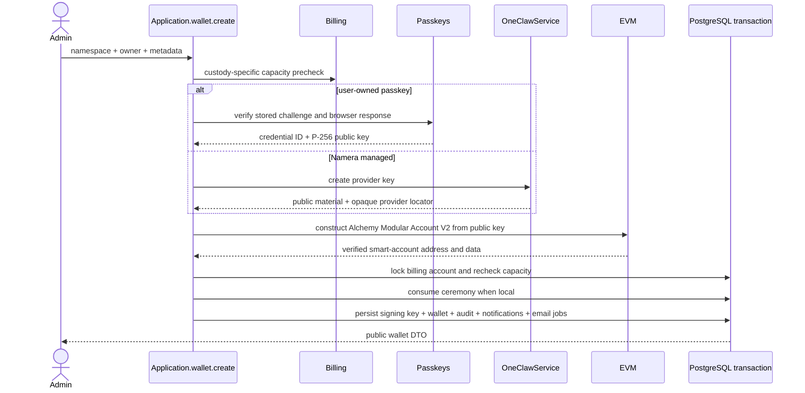

# Accounts and smart wallets

The dashboard calls a wallet an **account**. The backend and public contracts use
wallet terminology. A wallet combines organization-owned metadata, a
namespace-specific smart-account address, and one root signing key. That key is
either a user-owned passkey or Namera-managed provider material.

## Persistence and adapter references

The canonical per-column definitions, keys, foreign keys, checks, and indexes
for `core.signing_key` and `core.wallet` are in the
[core database catalog](../database/core-wallets-operations.md). Public EVM
responses expose address and Modular Account V2 reconstruction data; provider key
locators remain private. Smart-account versions, reconstruction, and
counterfactual behavior are documented in [EVM accounts](../evm/accounts/README.md).

## Creation

Managed provider key creation and namespace account derivation happen before the
transaction. Passkey verification also occurs before it, but the ceremony is
consumed in the final transaction. The second locked billing check prevents
concurrent requests from exceeding plan capacity. EntryPoint version,
implementation version, entity ID, salt, and P-256 signing policy are
server-owned constants rather than public input.

The shared owner model is discriminated. `POST /wallets` permits `passkey` and
`{type: "namera-managed", provider: "1claw"}` for users with `wallet:create`.
GCP requests still receive HTTP 403 `MANAGED_WALLETS_DISABLED` before provider
or billing work. Managed creation is limited to 20 attempts per organization per
hour. The dashboard offers User-owned passkey and 1Claw Managed on EVM.
Namera Managed and Solana remain disabled coming-soon choices. The 1Claw
selection skips WebAuthn, preserves the account-created next steps, and shows
the provider logo in account ownership displays. No provider credentials enter
the browser. Creation failures do not automatically retry remote provisioning.
1Claw creation has no protection-level claim. The server always composes its
SDK and OIDC services; there is no enable flag. Missing required configuration
fails startup. GCP and local-file provider runtime layers remain disabled.

### 1Claw organization setup and recovery

Application reserves one `provider_connections` row per org/app, using subject
`namera:org:<org-id>` and controlled email `org-<org-id>@ONECLAW_ORG_EMAIL_DOMAIN`.
It acquires a token-owned 60-second lease, renewed every 20 seconds. Remote calls
never hold a database transaction. Concurrent setup/renewal requests fail closed
while the lease is occupied; callers may retry after that request finishes.

Setup resolves a lost mapping by subject before upsert, records the remote
customer identity, validates and bootstraps the dashboard-created empty template,
redeems a claim, encrypts customer authority, and enables `agents:read`/`agents:write`
delegation. Bootstrap is marked attempted **before** sending it. An attempt without
recorded completion is ambiguous and requires operator reconciliation, not another
bootstrap. An existing unmapped reservation whose remote identity cannot be found
also requires investigation rather than another upsert.

Every account follows the same delegated create path: create one dedicated agent,
persist its one-time encrypted credential immediately, create an Ethereum wallet,
enable raw signing and verify key metadata. EVM derives a normal factory smart
account with that secp256k1 EOA owner (not EIP-7702). The final billing-locked
transaction rechecks capacity, tenant bindings and connection readiness, then
writes signer, account, audits, notification and outbox together. Free v2 admits
three 1Claw accounts independently of its ten local accounts.

Customer credentials expiring within two minutes are renewed under the connection
lease by reissuing/redeeming a claim. The existing encrypted envelope is authenticated
before replacement, and ciphertext CAS prevents a stale renewal overwriting newer
authority. No human API key is used. `provider_connection.updated` and
`provider_credential.saved` audits share the transactions of their state changes;
they contain stages/identifiers, never tokens or ciphertext.

Provider failure after agent creation, derivation failure or final persistence
failure can leave remote resources. The durable agent credential and its audit
remain, but account/signing-key/audit/notification writes roll back together.
There is no exactly-once per-account request key or automatic orphan deletion.
Do not blindly resubmit `PROVIDER_RECOVERY_REQUIRED`: inspect the connection,
credential audits and remote agent, then explicitly reconcile or retire unused
resources. Never delete a key that may control funds. Bootstrap ambiguities need
provider confirmation before a privileged operator records completion; no public
recovery endpoint is exposed.

The internal owner loader authenticates encrypted agent credentials and rechecks
wallet/key lifecycle, org/app connection readiness and pinned agent/key identity
at signing time. Provider signing verifies the exact digest and returned signer;
failures never fall back to GCP/local. No arbitrary root-signing HTTP endpoint is
added. Managed-owner installation/removal of local session keys is implemented
through explicit user approval and the existing receipt worker; see
[session keys](session-keys.md). Managed session-key custody/signing remain
later work; dashboard managed-owner approval is wired.

`/providers/1claw/.well-known/openid-configuration` and `/providers/1claw/jwks.json`
publish issuer metadata and public RSA fields only. Configure the Platform app's
trust with the exact issuer/audience. Issuer must equal the public API origin plus
`/providers/1claw`. Use HTTPS in production; the private key is server-only.
Overlapping signing-key rotation and live deployment trust validation remain
operational rollout work. Provider calls are tested with substitutes, not live funds.

The creation form starts WebAuthn registration after validating account metadata,
without a recovery acknowledgement checkbox. The account overview retains the
notice that email login cannot restore the owner passkey and that losing every
copy may lock funds and prevent onchain session removal. No acknowledgement is
added to wallet metadata or the public DTO.
Owner replacement/recovery and the associated mainnet safety decision remain open.

Owner variants:

- `passkey` includes the one-time verification ID and browser registration
  response. The server verifies user presence, user verification, challenge,
  origin, RP ID, and ES256 before storing only the credential identifier and
  public key.
- Internally, `namera-managed` includes `software` or `hsm` protection. The explicit
  `GcpService` creates the private key; only its opaque locator and
  public key are persisted.

Free v1 allows 50 local passkey wallets. They do not consume a periodic meter
and have no overage price. Managed software and HSM wallets retain their existing
resource entitlements and billing classification.

`GET /ens/availability?label=...` remains an unauthenticated, IP-rate-limited
lookup. Wallet creation does not check,
reserve, or create an ENS subname.

## EVM implementations

- Alchemy Modular Account V2 uses EntryPoint 0.7 and the WebAuthn P-256 validation module.
- EVM owns public-key-to-account construction and persisted account
  reconstruction. Application does not contain chain-specific derivation code.
- Reconstruction derives the smart-account address and rejects persisted data
  when it does not match the stored address.
- Managed owner signatures use application-supplied callbacks backed by explicit
  1Claw (or legacy internal GCP/local) services and adapter-owned
  EVM formatting. A local root cannot be signed by the server.

See [supported EVM chains](../evm/supported-chains.md) for registry/provider
requirements and [wallet-key providers](wallet-keys.md) for custody boundaries.

## Reads and updates

User actors list/get wallets in the active organization with `wallet:read`.
Machine actors see only wallets reachable through active grants to active
session keys. Metadata updates require `wallet:update`; same-value replacements
are no-ops without duplicate audit, notification, or metrics. Account creation
accepts an optional presentation description alongside its name and logo.

Public wallet responses include safe owner information: signing-key ID, custody,
algorithm, and managed protection level when applicable. They never expose a
provider locator, passkey credential ID, or private material.

The prepared 1Claw response variant exposes `provider: "1claw"` and
`algorithm: "secp256k1"` instead of a protection level. Its mapper includes no
credential ID, agent ID, key/version locator or encrypted payload and rejects
non-Ethereum 1Claw owners. Existing passkey and local/GCP response shapes remain
unchanged. HTTP integration tests cover provisioning, capacity, encryption,
renewal, permission/rate-limit rejection, ambiguous bootstrap and GCP rejection.
PostgreSQL tests additionally cover concurrent setup and last-slot admission.
Internal owner tests cover verified signatures, revocation and mismatched bindings.

Phase 5 adds an explicit factory ECDSA response variant with owner address, salt,
factory and implementation versions. Its mapper preserves reconstruction metadata
without exposing provider credentials or changing passkey/7702 responses. The EVM
adapter and local-fork tests are implemented; Phase 6 exposes 1Claw account creation.

Routes are `POST /wallets`, `GET /wallets`, `GET /wallets/:walletId`,
`GET /wallets/:walletId/portfolio`, and `POST /wallets/:walletId/update`. The
portfolio route returns paginated native/ERC-20 holdings across every supported
chain; see [fungible wallet portfolio](../evm/portfolio.md).

## Passkey registration ceremony

`POST /wallets/passkey/registration-options` requires an authenticated user
with `wallet:create`. The `@namera-ai/passkeys` capability uses SimpleWebAuthn
to generate ES256-only options for the dashboard RP. Resident credentials and
user verification are required; attestation is not requested. The application
stores a five-minute `passkey-registration` verification containing the exact
challenge, RP ID, origin, organization, and user, revoking the prior pending
ceremony for the same tenant/user tuple in the same transaction. The response
contains the verification ID, browser-ready options, and expiry.

Each ceremony uses a fresh WebAuthn user handle, independent of the Namera user
ID. Reusing the same RP/user handle for multiple wallets can cause an
authenticator to replace the earlier wallet's discoverable credential. Tenant
and user authorization remain bound by the server-side verification record.

Wallet creation loads the stored ceremony, checks every tenant/user/lifecycle
binding and expiry, verifies it through the passkey capability, and atomically
consumes it with the signing-key, wallet, audit, notification, and email writes.
Reuse fails even when the same browser response is submitted again. Invalid
responses increment the bounded verification attempt counter.

Owner authentication verification and atomic counter advancement are implemented
as separate capabilities. The passkey service verifies the assertion against a
stored credential and exact challenge; the signing-key repository advances its
counter with a compare-and-set update. The owner-approval workflow
consumes its challenge and advances that counter in one transaction. Synced
credentials may keep counter zero, so counter checks do not replace one-time
approval consumption.
