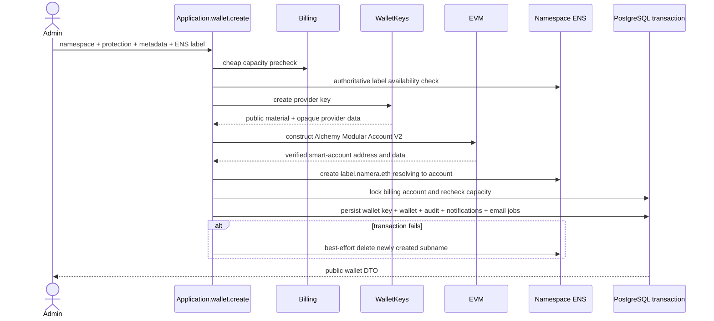

# Accounts and smart wallets

The dashboard calls a wallet an **account**. The backend and public contracts use
wallet terminology. A wallet combines organization-owned metadata, a
namespace-specific smart-account address, and one provider-managed owner key.

## Persistence and adapter references

The canonical per-column definitions, keys, foreign keys, checks, and indexes
for `core.wallet_key` and `core.wallet` are in the
[core database catalog](../database/core-wallets-operations.md). Public EVM
responses expose address and Modular Account V2 reconstruction data; provider key
locators remain private. Smart-account versions, reconstruction, and
counterfactual behavior are documented in [EVM accounts](../evm/accounts/README.md).

## Creation

Remote key and account creation happens before the transaction. The second
locked billing check prevents concurrent requests from exceeding plan capacity.
EntryPoint version, implementation version, entity ID, salt, and P-256 signing
policy are server-owned constants rather than public input.

The label is decoded with ENSIP normalization and must contain 4–63 characters
without a domain suffix. `GET /ens/availability?label=...` is an unauthenticated,
IP-rate-limited convenience check and returns the normalized label, full
`<label>.namera.eth` name, and availability. It is not an allocation guarantee;
wallet creation rechecks availability and maps provider races to HTTP 409 before
creating the subname with its owner and Ethereum address set to the account.
Development and production both use the Namespace mainnet API.

## EVM implementations

- Alchemy Modular Account V2 uses EntryPoint 0.7 and the WebAuthn P-256 validation module.
- Account creation and reconstruction share the same constructors.
- Reconstruction derives the smart-account address and rejects persisted data
  when it does not match the stored address.
- Owner signatures use provider-neutral key operations and adapter-owned EVM
  formatting.

See [supported EVM chains](../evm/supported-chains.md) for registry/provider
requirements and [wallet-key providers](wallet-keys.md) for custody boundaries.

## Reads and updates

User actors list/get wallets in the active organization with `wallet:read`.
Machine actors see only wallets reachable through active grants to active
session keys. Metadata updates require `wallet:update`; same-value replacements
are no-ops without duplicate audit, notification, or metrics. Account creation
accepts an optional presentation description alongside its name and logo.

Routes are `POST /wallets`, `GET /wallets`, `GET /wallets/:walletId`,
`GET /wallets/:walletId/portfolio`, and `POST /wallets/:walletId/update`. The
portfolio route returns paginated native/ERC-20 holdings across every supported
chain; see [fungible wallet portfolio](../evm/portfolio.md).

## Pending

- Add compensation/reconciliation for an external provider key created before a
  failed account-construction or persistence boundary.
- Persist the assigned ENS name locally if account views need it without a
  provider lookup.
- Define freeze/archive semantics before adding those lifecycle operations.
- Add another namespace only through a new discriminated chain adapter rather
  than EVM conditionals in application workflows.
