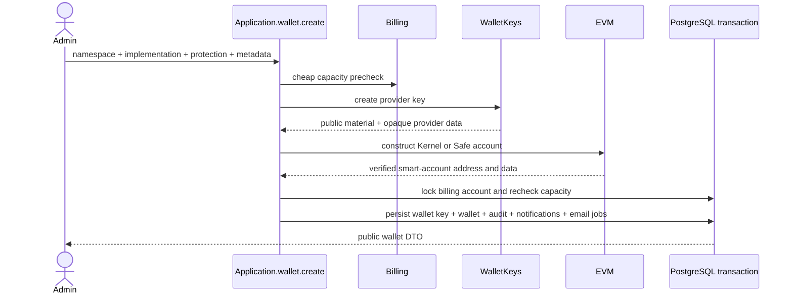

# Accounts and smart wallets

The dashboard calls a wallet an **account**. The backend and public contracts use
wallet terminology. A wallet combines organization-owned metadata, a
namespace-specific smart-account address, and one provider-managed owner key.

## Tables

### `core.wallet_key`

Stores organization, provider, algorithm, protection level, lifecycle status,
public key, and provider-discriminated opaque data. It never stores a private
key. `(id, organization_id)` is unique and organization/status is indexed.

### `core.wallet`

Stores organization, wallet-key reference, metadata, status, creator actor,
namespace, namespace-discriminated account data, and timestamps. Composite
foreign keys require the wallet key and creator to belong to the organization.
Indexes support organization/status, wallet-key, and creator lookups.

Public EVM responses contain the address and Kernel- or Safe-discriminated
account configuration. Provider key references and provider metadata remain
private.

## Creation

Remote key and account creation happens before the transaction. The second
locked billing check prevents concurrent requests from exceeding plan capacity.
EntryPoint version, implementation version, account index, salt nonce, and P-256
signing policy are server-owned constants rather than public input.

## EVM implementations

- Kernel and Safe use EntryPoint 0.7.
- Account creation and reconstruction share the same constructors.
- Reconstruction derives the smart-account address and rejects persisted data
  when it does not match the stored address.
- Owner signatures use provider-neutral key operations and adapter-owned EVM
  formatting.

## Reads and updates

User actors list/get wallets in the active organization with `wallet:read`.
Machine actors see only wallets reachable through active grants to active
session keys. Metadata updates require `wallet:update`; same-value replacements
are no-ops without duplicate audit, notification, or metrics.

Routes are `POST /wallets`, `GET /wallets`, `GET /wallets/:walletId`, and
`POST /wallets/:walletId/update`.

## Pending

- Add compensation/reconciliation for an external provider key created before a
  failed account-construction or persistence boundary.
- Define freeze/archive semantics before adding those lifecycle operations.
- Add another namespace only through a new discriminated chain adapter rather
  than EVM conditionals in application workflows.
