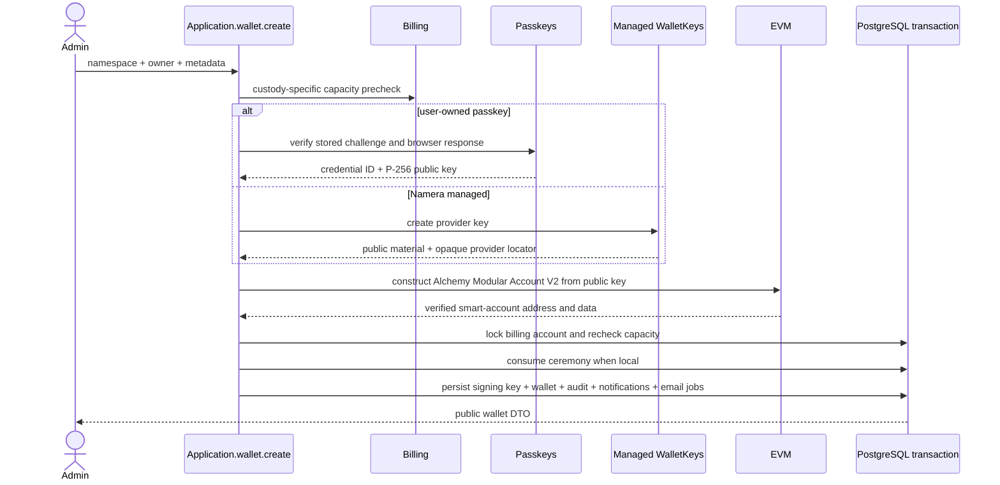

# Accounts and smart wallets

The dashboard calls a wallet an **account**. The backend and public contracts use
wallet terminology. A wallet combines organization-owned metadata, a
namespace-specific smart-account address, and one root signing key. That key is
either a user-owned passkey or Namera-managed provider material.

## Persistence and adapter references

The canonical per-column definitions, keys, foreign keys, checks, and indexes
for `core.signing_key` and `core.wallet` are in the
[core database catalog](../database/core-wallets-operations.md). Public EVM
responses expose address and Modular Account V2 reconstruction data; provider key
locators remain private. Smart-account versions, reconstruction, and
counterfactual behavior are documented in [EVM accounts](../evm/accounts/README.md).

## Creation

Managed provider key creation and namespace account derivation happen before the
transaction. Passkey verification also occurs before it, but the ceremony is
consumed in the final transaction. The second locked billing check prevents
concurrent requests from exceeding plan capacity. EntryPoint version,
implementation version, entity ID, salt, and P-256 signing policy are
server-owned constants rather than public input.

The shared owner model is discriminated. The beta HTTP route `POST /wallets`
permits only `passkey`; authenticated managed requests receive HTTP 403
`WalletCustodyUnavailableError` / `MANAGED_WALLETS_DISABLED` before any billing,
provider, or persistence work. The dashboard offers only passkey creation.
Managed construction remains internal for future use and is not a beta feature.

The dashboard requires an unchecked-by-default recovery acknowledgement before
starting WebAuthn registration. It explains that email login cannot restore the
owner passkey and that losing every copy may lock funds and prevent onchain
session removal. The account overview repeats this notice for local owners.
This is a presentation safeguard, not a recovery implementation or server-side
attestation. No acknowledgement is added to wallet metadata or the public DTO.
Owner replacement/recovery and the associated mainnet safety decision remain open.

Owner variants:

- `passkey` includes the one-time verification ID and browser registration
  response. The server verifies user presence, user verification, challenge,
  origin, RP ID, and ES256 before storing only the credential identifier and
  public key.
- Internally, `namera-managed` includes `software` or `hsm` protection. The configured
  `WalletKeys` provider creates the private key; only its opaque locator and
  public key are persisted.

Free v1 allows 50 local passkey wallets. They do not consume a periodic meter
and have no overage price. Managed software and HSM wallets retain their existing
resource entitlements and billing classification.

`GET /ens/availability?label=...` remains an unauthenticated, IP-rate-limited
lookup for future standalone naming flows. Wallet creation does not check,
reserve, or create an ENS subname.

## EVM implementations

- Alchemy Modular Account V2 uses EntryPoint 0.7 and the WebAuthn P-256 validation module.
- EVM owns public-key-to-account construction and persisted account
  reconstruction. Application does not contain chain-specific derivation code.
- Reconstruction derives the smart-account address and rejects persisted data
  when it does not match the stored address.
- Managed owner signatures use provider-neutral key operations and adapter-owned
  EVM formatting. A local root cannot be signed by the server.

See [supported EVM chains](../evm/supported-chains.md) for registry/provider
requirements and [wallet-key providers](wallet-keys.md) for custody boundaries.

## Reads and updates

User actors list/get wallets in the active organization with `wallet:read`.
Machine actors see only wallets reachable through active grants to active
session keys. Metadata updates require `wallet:update`; same-value replacements
are no-ops without duplicate audit, notification, or metrics. Account creation
accepts an optional presentation description alongside its name and logo.

Public wallet responses include safe owner information: signing-key ID, custody,
algorithm, and managed protection level when applicable. They never expose a
provider locator, passkey credential ID, or private material.

Routes are `POST /wallets`, `GET /wallets`, `GET /wallets/:walletId`,
`GET /wallets/:walletId/portfolio`, and `POST /wallets/:walletId/update`. The
portfolio route returns paginated native/ERC-20 holdings across every supported
chain; see [fungible wallet portfolio](../evm/portfolio.md).

## Passkey registration ceremony

`POST /wallets/passkey/registration-options` requires an authenticated user
with `wallet:create`. The `@namera-ai/passkeys` capability uses SimpleWebAuthn
to generate ES256-only options for the dashboard RP. Resident credentials and
user verification are required; attestation is not requested. The application
stores a five-minute `passkey-registration` verification containing the exact
challenge, RP ID, origin, organization, and user, revoking the prior pending
ceremony for the same tenant/user tuple in the same transaction. The response
contains the verification ID, browser-ready options, and expiry.

Each ceremony uses a fresh WebAuthn user handle, independent of the Namera user
ID. Reusing the same RP/user handle for multiple wallets can cause an
authenticator to replace the earlier wallet's discoverable credential. Tenant
and user authorization remain bound by the server-side verification record.

Wallet creation loads the stored ceremony, checks every tenant/user/lifecycle
binding and expiry, verifies it through the passkey capability, and atomically
consumes it with the signing-key, wallet, audit, notification, and email writes.
Reuse fails even when the same browser response is submitted again. Invalid
responses increment the bounded verification attempt counter.

Owner authentication verification and atomic counter advancement are implemented
as separate capabilities. The passkey service verifies the assertion against a
stored credential and exact challenge; the signing-key repository advances its
counter with a compare-and-set update. The owner-approval workflow
consumes its challenge and advances that counter in one transaction. Synced
credentials may keep counter zero, so counter checks do not replace one-time
approval consumption.

## Pending

- Add compensation/reconciliation for an external provider key created before a
  failed account-construction or persistence boundary.
- Verify the complete browser/live-chain installation and removal journey;
  owner approval routes and dashboard ceremonies are wired, with HTTP and
  separate Anvil contract coverage. See [session keys](session-keys.md).
- Add a standalone, transactional account naming workflow before assigning ENS
  names to wallets.
- Define freeze/archive semantics before adding those lifecycle operations.
- Add another namespace only through a new discriminated chain adapter rather
  than EVM conditionals in application workflows.
