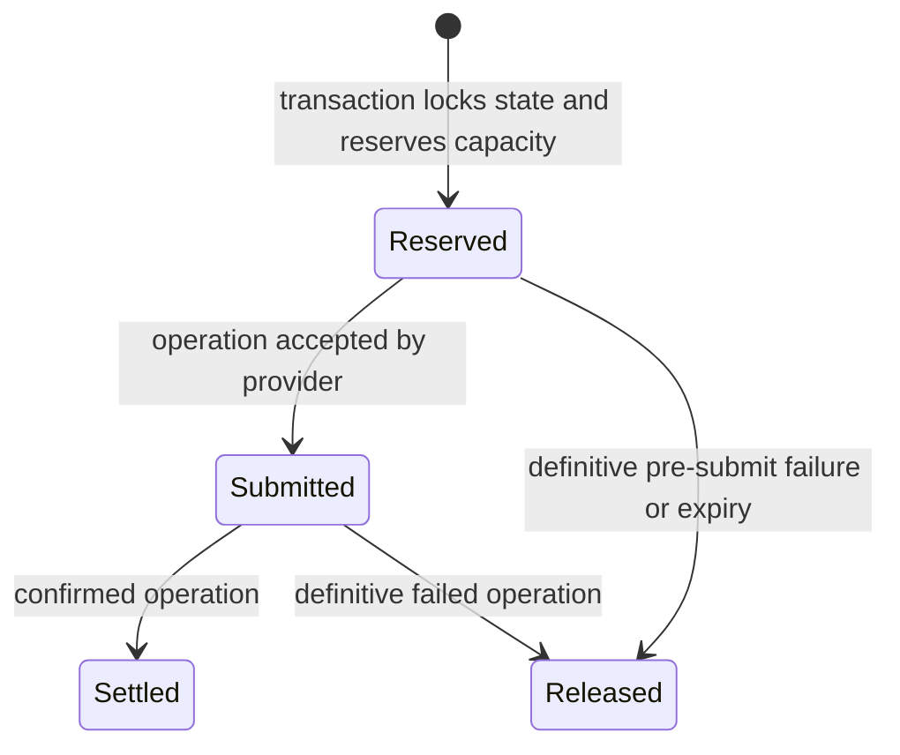

# EVM policy engine

Policies are immutable, versioned, offchain controls evaluated before Namera's
wallet-owner key signs. They protect against compromised agents and delegated
credentials, but do not independently protect against simultaneous compromise
of the policy service and wallet-key signer.

## Registry contract

Every policy type has one registry entry declaring:

- operation applicability: execution, signature, or both;
- singleton or repeatable cardinality;
- deterministic priority;
- execution and signature adapters;
- whether a signature handler grants signature authority;
- optional state initialization and reserve/settle/release behavior.

The registry materializes code-owned applicability and stable policy IDs. The
application has no switch over policy names. Evaluation order is priority then
policy ID, producing deterministic first-denial attribution.

## Implemented policies

| Type                        | Applies to | Priority | State                 | Behavior                                                                                                                |
| --------------------------- | ---------- | -------: | --------------------- | ----------------------------------------------------------------------------------------------------------------------- |
| `evm.time-window` v1        | both       |      100 | none                  | Optional inclusive start and required exclusive expiry. Execution uses simulated block time; signatures use server UTC. |
| `evm.chain-allowlist` v1    | both       |      200 | none                  | Requires requested CAIP-2 chain in a non-empty unique allowlist. Does not grant signing by itself.                      |
| `evm.gas-budget` v1         | execution  |      400 | fixed window/lifetime | Per-chain native gas-cost budgets for hour, day, week, or lifetime.                                                     |
| `evm.native-spend-limit` v1 | execution  |      500 | fixed window/lifetime | Per-chain explicit native call value limits for operation, hour, day, week, month, or lifetime.                         |
| `evm.signature` v1          | signature  |      600 | none                  | Explicitly grants message, typed-data, or both signature types.                                                         |

Each type is currently a singleton. Chain/period pairs inside gas and native
policies must be unique.

## Execution context

The EVM adapter reconstructs the account, prepares a stub-signed EntryPoint 0.7
UserOperation, runs `eth_estimateUserOperationGas`, and calls Viem
`simulateCalls` with asset-change and native-transfer tracing. Version 1 context
contains:

- exact normalized calls and total explicit native value;
- supported chain and simulated block number/hash/timestamp;
- account, EntryPoint, paymaster, nonce, gas limits, and fee limits;
- per-call success, return data, and gas used;
- account-relative asset pre/post/diff values;
- normalized native transfers attributed to call index.

Provider symbol/decimals are display metadata, never authorization inputs.
Bundler simulation validates the ERC-4337 envelope; `simulateCalls` explains
inner-call effects. Policies that depend on simulation must fail closed when the
required result is unavailable or failed.

## Stateful lifecycle

State keys encode policy instance and logical scope. Fixed windows use UTC hour,
day, Monday-starting week, or month boundaries derived from the simulated block;
lifetime uses one stable key. No reset job is needed. Confirmations settle the
original reserved window even after the current window changes.

Native spend reserves summed explicit `call.value`. An unconfigured chain
allows zero value but denies positive value. Gas budgets reserve pessimistic
UserOperation gas cost and settle actual receipt cost. Transactions lock state
so concurrent last-capacity requests cannot both pass.

## Decisions

Denied decisions contain `{ allowed: false, policyId, code }`. Current bounded
codes distinguish time not started/expired, chain not allowed, gas chain missing
or budget exceeded, native-spend chain missing or limit exceeded, and signature
type not allowed. A missing signature-capability policy returns
`SIGNATURE_POLICY_REQUIRED`.

## Pending

Recommended next policies, in dependency order:

1. `evm.call-allowlist`: exact target and four-byte selector authorization for
   every call; unmatched/short/malformed calls fail closed.
2. `evm.erc20-spend-limit`: outgoing ERC-20 transfer budgets using trusted
   calldata decoding plus conservative simulated asset-delta checks.
3. `evm.erc20-approval-limit`: spender/token allowance ceilings with unlimited
   approval denied by default.
4. `evm.usage-limit`: per-session-key execution/signature counts using the
   existing generic reservation ownership.
5. A stricter signature policy version with EIP-712 chain, verifying contract,
   domain name/version, and primary-type allowlists.

Also add stale-reservation monitoring, production defaults that require an
explicit chain allowlist, and explicit maximum time-window duration/future start
rules when product limits are decided.
