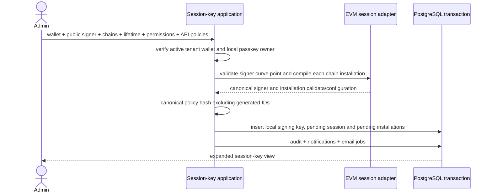

# Session keys and grants

A session key is an immutable delegation attached to one wallet and one
`signing_key`. Registration accepts a local secp256k1 public key; Namera never
receives its private key. Chain installations store the compiled onchain
authorization separately from additional API policies. Registration is pending,
not authority to execute. Machine actors additionally require an active grant.

Onchain signature authority requires explicit `onchain.allowSignatures: true`
during registration. It defaults to false even with an API `evm.signature`
policy. The value is stored in each installation authorization and bound into
the owner-approved configuration. Alchemy's execution time/spend hooks do not
constrain ERC-1271 signatures; only onchain uninstall removes that authority.
See [onchain session compilation](../evm/accounts/onchain-sessions.md).

The SDK and local MCP sign delegated operations using client-held session keys.
The dashboard can register/export a local signer and approve installation/removal.
Browser and live-chain end-to-end verification remain pending.

## Persistence and policy references

The complete `core.session_key`, `core.session_key_grant`, policy-state, and
policy-reservation definitions are in the
[core database catalog](../database/core-wallets-operations.md). Generic state
initialization, deterministic lock order, operation ownership, settlement, and
release are documented in
[policy state and reservations](../evm/policies/state-reservations.md). The
[policy catalog](../evm/policies/catalog.md) defines current behavior and denial
codes.

## Creation

Policy hashing uses purpose-separated SHA-256 over canonical JSON, sorts object
keys, ignores generated policy IDs, and is invariant to policy-array order.
Creation requires a finite, non-expired onchain lifetime and rejects repeated
singleton API policy types. API policies may be empty. Duplicate signer public
keys within a tenant return `SIGNER_ALREADY_REGISTERED` using a conflict-safe
insert inside the transaction; no orphan session or duplicate notification is
created. Each installation has a separate domain-separated configuration hash
binding wallet, signer identity, chain and compiled authorization.

The database defaults sessions to `pending`. Its activation operation requires
at least one installed chain record; operation authorization must also verify
the requested chain's installation. Receipt reconciliation invokes activation
only after confirming the installation.

## Owner approval

`POST /session-keys/operations/prepare` takes an installation ID, install/uninstall
kind, idempotency key and sponsorship choice. It accepts no arbitrary calldata.
Only a user with the corresponding create/revoke permission may prepare it.
The EVM adapter prepares the stored self-call using the public passkey owner.
A short transaction locks the wallet and owner key, repeats lifecycle checks,
enforces one pending owner operation per wallet/chain, and records the exact
prepared operation plus an audit event. Provider calls happen outside this lock.
Retries return the same operation and challenge; changing the request under the
same key is rejected. The challenge signs the precise ERC-4337 digest using the
account's WebAuthn encoding, not an unrelated random approval token.

`POST /session-keys/operations/complete` accepts the operation ID and a browser
assertion. The original actor must still have the operation's permission. The
live passkey verifier checks credential, RP, origin, user verification, challenge
and counter. EVM validates and encodes the assertion against the persisted
operation. The transaction repeats owner/lifecycle checks, advances the counter,
conditionally accepts the signature, reserves execution/gas usage and appends
the approval audit event. Quota failure rolls back all these writes. A successful
retry reads the durable state without advancing the counter or charging twice.

Completion returns `signed`; the scoped session-key worker owns broadcasting
and receipt processing. Session-operation billing holds use source type
`session-key-operation` and are deliberately deferred by generic expiry recovery.
They cannot be released merely because a signed root operation's HTTP or approval
TTL elapsed. No private key or signed operation is returned in the completion
response. Registration/approval alone never sets a session to active.

`GET /session-keys/operations/:operationId` allows organization users with
`session-key:read` to poll only operation ID and status. Cross-tenant IDs return
`OPERATION_UNAVAILABLE`; machine credentials cannot read owner approval records.
Neither signed envelopes nor private approval/lease data cross this boundary.

## Receipt recovery

The worker runs every five seconds after database migrations, expires only
unsigned approvals, and claims up to 20 signed/submitted operations with two-minute
leases. Four operations may reconcile concurrently. It queries receipts before
resubmitting the identical stored signed operation; ambiguous provider failures
retain both signature and quota reservation and retry after 15 seconds.

Receipt chain, UserOperation hash, sender, nonce and EntryPoint must match the
persisted signed envelope. Under the wallet lock and a live lease, one transaction
finishes the operation ledger, updates the installation, activates successful
installations, settles execution/gas reservations and appends an audit event.
Included failures consume execution usage and actual sponsored gas. Failed
installations may retry; failed uninstalls leave the permission installed.
Approval TTL never releases a signed operation's reservation. Stuck owner nonces
still need explicit cancellation/replacement recovery before beta.

## Selection model

For one operation Namera evaluates complete granted session keys independently.
It never combines rules from multiple keys. The first deterministic eligible key
whose applicable policies all pass is selected. Execution simulation reports
the first policy ID and bounded denial code for each denied candidate without
mutating state.

## Revocation

Revocation first changes a pending/active session to `revoking`, revokes every
active grant and expires unsigned owner approvals in one wallet-locked
transaction. `session_key.revocation_requested` records this immediate API
cutoff. `revokedAt` and `revokedByActorId` identify the request, not its later
onchain completion. Retries do not repeat the transition.

Signed owner operations remain recoverable: revocation cannot invalidate bytes
already signed by the owner. A late installation receipt must leave the session
`revoking`, never reactivate it. Installed chains require a new owner-approved
uninstall; preparing or completing an uninstall requires the session to already
be revoking. Failed included uninstalls leave that chain installed and retryable.

The database only permits final `revoked` status when no installation is
submitted, installed or revoking and no signed/submitted owner operation remains.
Never-installed pending/failed chains require no fabricated uninstall receipt.
The final transition, `session_key.revoked` audit event, notification and email
jobs share one transaction. A wholly unsigned registration can finish at the
initial request; otherwise receipt reconciliation finalizes it after the last
successful removal. Completion notifications are never sent at the initial API
cutoff while onchain authority remains.

## Reads

User actors read organization- or wallet-scoped expanded views with creator,
wallet and public installation data. Private material, operation leases and
installation calldata are not returned. Machine actors read key and wallet views only through their
active grants. Routes expose create/get/list/wallet-list/revoke boundaries under
`/session-keys`.

## Dashboard integration

`GET /wallets/:walletId/passkey-owner` exposes only the public P-256 key,
signing-key ID, credential ID and RP ID needed for owner-operation review. It
requires a user actor with `wallet:read` in the active organization; machine
grants do not authorize this endpoint. Other tenants receive `WALLET_NOT_FOUND`.
Non-passkey wallets return `owner: null`. The response is not cached and contains
no provider locator, counter, private key or signed envelope. Ordinary wallet
responses remain unchanged. This read has no audit event or mutation; normal
HTTP instrumentation covers it.

The SDK's `validateOwnerApproval` verifies decoded preparations against locally
reviewed chain, account, owner entity, factory arguments and compiled self-call.
It rejects altered authority, undeclared gas charges, expired approvals and
WebAuthn challenge/credential/RP substitutions. Its hash uses the canonical
EntryPoint and personal-sign encoding used by the deployed passkey adapter.
The guard is unit-tested; the EVM package supplies read-only account
reconstruction and session compilation. The dashboard uses it before opening
SimpleWebAuthn's authentication prompt. A caller must not treat the server's calldata as the locally
reviewed action.

Dashboard atoms and hooks expose preparation, completion and operation status
through the shared typed client. Completion invalidates session and billing
data; it does not optimistically activate a session. Status queries have a
five-second cache lifetime. The installation component refreshes operation status
every three seconds while pending and refreshes session/billing data on terminal
receipts. It retains the preparation idempotency key and the accepted browser
assertion in component memory across retries, without signing again after an
ambiguous completion response. Assertions do not survive navigation/reload;
active-operation lookup recovers the public retry identity or receipt status.
Typed approval failures
use the shared feedback registry; provider and assertion payloads are not shown.

Creation now separates onchain permissions from optional API policies. The
shared `components/policy/evm/onchain` editor covers all eight compiled permission
types with protocol-backed address, selector and integer-base-unit validation.
Root access requires a field-specific acknowledgement; API restrictions are
explicitly described as unable to constrain direct onchain use. The editor was
checked in an isolated browser harness for root consent and exact native amounts;
the harness was removed afterward. Dashboard unit regressions exercise the actual
form resolver for consent errors and exact integer amounts. Network selection,
minute-precision local-time lifetime controls, and explicit signature consent are
also present. Signature consent defaults off and explains that execution expiry
does not remove ERC-1271 authority. The account picker only offers active local
P-256 owners. Lifetime ordering failures attach to the expiry field; the server
still checks that the expiry has not passed when registering.
Creation generates a local SDK draft on first submission and puts only its public
signer in form/API state. The draft stays in a ref and is disposed on unmount or
after the user acknowledges importing/backing it up. Successful registration is
checked against the submitted configuration and selected wallet before constructing
local bindings. Mismatches prevent export. The screen labels registration as
pending, not usable authority.

The export form requires a confirmed passphrase of at least 12 characters and
uses the SDK WebCrypto codec. It clears passphrase fields after encryption and
shows a base64url encrypted `namera session-key import` command. Router navigation
and browser unload warn while the local key has not been acknowledged as saved.
The encrypted export was exercised with a disposable browser-only test key;
this does not prove the full registration/import/approval journey.

The shared installation panel appears in overview, policies, and creation after
the key is acknowledged as saved. It shows the signer, lifetime, onchain grants
and signature authority per network. Approval is BSO-sponsored and checks the
locally reconstructed account/factory, compiled call and expected WebAuthn
challenge before prompting. The public RPC proxy remains a trusted chain-data
source. Removal is offered only after API revocation; pending sessions can also
be revoked. Receipt confirmation, not successful HTTP completion, establishes
onchain installation. Network/state/credential errors leave a retry action.

The browser boundary has owner/account substitution regressions, and SDK/EVM
unit tests exercise compilation and envelope validation. The actual browser
prompt, encrypted import and live receipt journey still require verification.
A lost
registration response also needs a public-signer lookup recovery path so retrying
the same local draft can recover its existing pending registration.

### Recovering an owner approval

`GET /session-keys/installations/:installationId/operations/:kind` recovers the
active owner operation within the caller's organization. It returns only its ID
and status, plus the original preparation request for the initiating user while
the unsigned challenge remains valid. Other members can observe status but cannot
recover that user's retry request. Signed/submitted operations never return an
assertion or envelope. Terminal operations are absent from this lookup. The
dashboard resumes only owned unsigned sponsored requests matching the displayed
installation and action. Signed operations are polled without another prompt;
self-funded or other-user unsigned approvals must finish in their original client
or expire. Recovery lookup errors disable new approvals rather than falling back
to a new identity. The endpoint is covered for tenant
isolation, member visibility, expiration, and signed/confirmed transitions.

## Pending

- Complete stuck signed-operation cancellation/replacement recovery.
- Verify browser generation, encrypted export/import and owner-approved creation
  end to end, including recovery after navigation/reload.
- Verify dashboard removal on every installed chain, including partial failures.
- Add retention behavior for expired/revoked keys and historical grants.
- Per-grant editing is intentionally unsupported; revoke/replace the parent
  credential or authorization instead.
