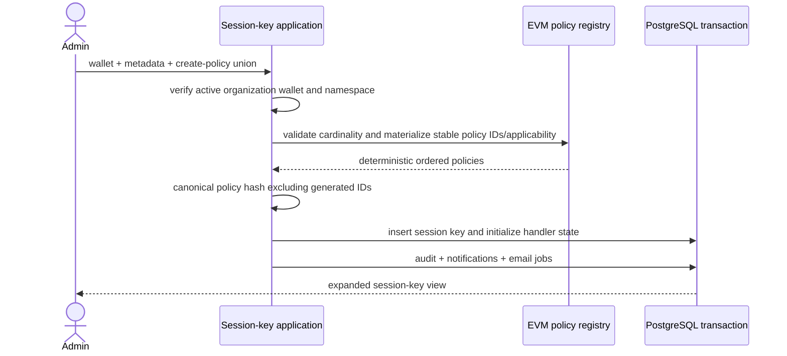

# Session keys and grants

A session key is an immutable policy bundle attached to one wallet. It is not a
secret signing key: Namera's wallet owner remains the signer. A session key
describes delegated authority and becomes usable by a machine actor only through
an active grant.

## Persistence and policy references

The complete `core.session_key`, `core.session_key_grant`, policy-state, and
policy-reservation definitions are in the
[core database catalog](../database/core-wallets-operations.md). Generic state
initialization, deterministic lock order, operation ownership, settlement, and
release are documented in
[policy state and reservations](../evm/policies/state-reservations.md). The
[policy catalog](../evm/policies/catalog.md) defines current behavior and denial
codes.

## Creation

Policy hashing uses purpose-separated SHA-256 over canonical JSON, sorts object
keys, ignores generated policy IDs, and is invariant to policy-array order.
Creation requires a non-expired time window and rejects repeated singleton
policy types. It does not impose arbitrary payload, call-count, or address-list
limits beyond each policy schema's semantic validation.

## Selection model

For one operation Namera evaluates complete granted session keys independently.
It never combines rules from multiple keys. The first deterministic eligible key
whose applicable policies all pass is selected. Execution simulation reports
the first policy ID and bounded denial code for each denied candidate without
mutating state.

## Revocation

Revoking a session key conditionally marks it revoked and revokes all active
grants in the same transaction. The first transition appends audit,
notifications, and email jobs; retries are side-effect-free. API-key, OAuth, and
dashboard caches refresh because their grant views change.

## Reads

User actors read organization- or wallet-scoped expanded views with creator and
wallet data. Machine actors read compact key and wallet views only through their
active grants. Routes expose create/get/list/wallet-list/revoke boundaries under
`/session-keys`.

## Pending

- Add retention behavior for expired/revoked keys and historical grants.
- Per-grant editing is intentionally unsupported; revoke/replace the parent
  credential or authorization instead.
- Add account- and session-key-scoped execution history queries.
