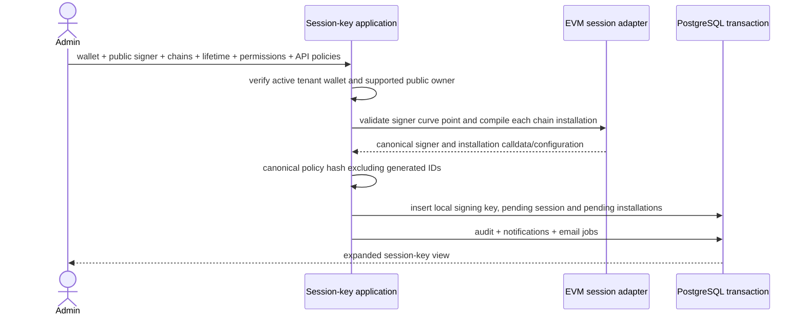

# Session keys and grants

A session key is an immutable delegation attached to one wallet and one
`signing_key`. Registration accepts a local secp256k1 public key or provisions a
dedicated 1Claw-managed session key; local private keys never reach Namera.
Chain installations store the compiled onchain
authorization separately from additional API policies. Registration is pending,
not authority to execute. Machine actors additionally require an active grant.

Onchain signature authority requires explicit `onchain.allowSignatures: true`
during registration. It defaults to false even with an API `evm.signature`
policy. The value is stored in each installation authorization and bound into
the owner-approved configuration. Alchemy's execution time/spend hooks do not
constrain ERC-1271 signatures; only onchain uninstall removes that authority.
See [onchain session compilation](../evm/accounts/onchain-sessions.md).

The SDK and local MCP use client-held local keys or server-held 1Claw session keys
through the same execute/sign methods and HTTP endpoints.
The dashboard can register/export a local signer and approve installation/removal.

## Persistence and policy references

The complete `core.session_key`, `core.session_key_grant`, policy-state, and
policy-reservation definitions are in the
[core database catalog](../database/core-wallets-operations.md). Generic state
initialization, deterministic lock order, operation ownership, settlement, and
release are documented in
[policy state and reservations](../evm/policies/state-reservations.md). The
[policy catalog](../evm/policies/catalog.md) defines current behavior and denial
codes.

## Creation

### Managed-custody contract foundation (Phase 11)

The creation schema accepts either the existing local signer or
`{ custody: "namera-managed", provider: "1claw", algorithm: "secp256k1" }`.
Managed input must not contain public/private key material, agent IDs, credential
IDs or connection IDs. Phase 12 enables pending managed-session creation through
the existing endpoint. `MANAGED_SESSION_KEYS_UNAVAILABLE` remains the failure
when the provider services are absent, not a deployment feature flag.

Full session responses expose `signer` with custody, algorithm and public key,
plus provider for managed custody. Mapping explicitly excludes credential and
provider-resource references. Summary projections remain unchanged: consumers
must load a full session before selecting its signing path. Parent account
ownership determines installation approval, not session signer custody. Local
SDK bindings and dashboard registration recovery reject managed requests.

The signing-key lookup is tenant- and session-purpose-scoped. The database binds
each session to a `purpose = session` signer and requires a provider connection
for 1Claw session signers. Existing credential/connection foreign keys enforce
tenant ownership; encrypted credential-to-agent binding remains a provisioning
and signing boundary check, not a JSON foreign-key guarantee. Typed creation
errors map setup failures to `PROVIDER_SETUP_FAILED` and ambiguous/partial
provisioning to `PROVIDER_RECOVERY_REQUIRED`; vendor responses are not public errors.

Contract, mapper, local compatibility and database boundary tests cover these
invariants, including root-key substitution and cross-tenant references.

### Managed provisioning (Phase 12)

User authorization precedes the application call. Managed creation is limited to
20 attempts per organization per hour; local creation retains its existing behavior.
The application validates the parent, lifetime, policy cardinality and the managed
session allowance. A discarded public-only compilation using the account address
checks network/permission eligibility before provider allocation. It is never
stored or signed; final installation calldata is compiled with the new session key.

The shared 1Claw provisioner receives explicit `session` purpose (`wallet-root`
for account creation). It reuses or initializes the organization's empty-bootstrap
connection, saves the one-time agent credential encrypted with its audit, creates
one Ethereum key, enables raw signing and verifies key metadata. The session
agent/key is separate from the account owner, regardless of owner custody.

The final transaction locks billing, repeats the custody-specific capacity and
account/lifetime checks, validates the agent credential binding and ready tenant
connection, and inserts signer, pending session, pending installations, audit,
notifications and email jobs atomically. No installation approval, activation,
grant or signature is performed. No new table, migration or configuration is needed.

Remote resources cannot roll back with the final transaction. Persisted encrypted
credentials and their audits survive later failure for operator reconciliation;
there is no automatic agent-create retry or orphan deletion. Compilation/storage
failure after provisioning returns `PROVIDER_RECOVERY_REQUIRED`. A lost final quota
race or expiry still returns the corresponding domain error and may leave an
unreferenced agent; inspect saved credential audits before manual cleanup.

HTTP tests cover both parent owners, first setup and connection reuse, independent
quotas, encrypted/non-public credentials, permission/tenant/expiry rejection,
ambiguous bootstrap, rate limits, disabled connections and transaction rollback.
Disposable PostgreSQL verifies last-slot concurrent admission. Provider and chain
services are substitutes; this is not live-provider or mainnet verification.
Lifecycle compatibility, managed execution/signing and client/dashboard custody
selection are implemented. Development provider verification remains Phase 17.

### Managed operation recovery (Phases 14–15)

The unified `/executions/prepare` and `/signatures/prepare` endpoints resolve
custody from the granted session. Managed responses return `signing.method = server`;
completion on the shared routes accepts only stored operation identifiers, with the same actor, grant, installation, expiry and policy checks.
The shared 1Claw session resolver rejects wallet-root keys and verifies encrypted
credential, tenant, connection, agent and public-key bindings.

- Execution submissions already contain actor-bound idempotency, lease tokens,
  lease expiry, prepared data, signed execution and a broadcast-attempt marker.
  Phase 14 adds fenced claim/accept transitions, a public signer-binding snapshot,
  and two-minute exclusive signing leases. Existing reconciliation and signed
  envelope storage are reused without a second submission/provisioning table.
- Returned message/typed-data signatures must not be persisted in the database,
  including encrypted result caches, or written to logs. Keep operation metadata,
  authorization, billing and audit state, but do not promise response replay.
  If provider signing succeeds and the response is lost, an explicit retry may
  sign again and incur another signature charge. This is an accepted product
  trade-off, not an exactly-once delivery guarantee. A succeeded managed operation
  cannot replay; a fresh idempotency key reserves a fresh authorized billable
  attempt. Two nullable signature-operation lease columns fence provider work.
  Expiry recovery clears the lease and holds; late results cannot settle them.
  See [executions](../operations/executions.md) and
  [signatures](../operations/signatures.md) for the exact transitions.

This no-result-storage decision applies to message/typed-data signing. It does
not change existing signed execution submission persistence or broadcast recovery;
duplicate onchain execution must still be prevented.

Neither path may expose a general-purpose raw-signing API or substitute a root
owner signature for a session signature.

Policy hashing uses purpose-separated SHA-256 over canonical JSON, sorts object
keys, ignores generated policy IDs, and is invariant to policy-array order.
Creation requires a finite, non-expired onchain lifetime and rejects repeated
singleton API policy types. API policies may be empty. Duplicate signer public
keys within a tenant return `SIGNER_ALREADY_REGISTERED` using a conflict-safe
insert inside the transaction; no orphan session or duplicate notification is
created. Each installation has a separate domain-separated configuration hash
binding wallet, signer identity, chain and compiled authorization.

The database defaults sessions to `pending`. Its activation operation requires
at least one installed chain record; operation authorization must also verify
the requested chain's installation. Receipt reconciliation invokes activation
only after confirming the installation.

## Owner approval

Registration and delegated execution reconstruct the parent account using only
public owner material: either a local passkey or a 1Claw-managed Ethereum
secp256k1 factory-account owner. Compilation, simulation and local session
preparation do not decrypt provider credentials or invoke the root signer.
Session signers may be local or 1Claw-managed. Installation and removal use the
stored public authorization and parent owner only, never the session credential.

### Custody compatibility (Phase 13)

Both session custody types use the existing owner-operation routes and ledger:

| Parent account | Session key | Installation/removal approval |
| -------------- | ----------- | ----------------------------- |
| Passkey        | Local       | Passkey prepare/complete      |
| Passkey        | 1Claw       | Passkey prepare/complete      |
| 1Claw          | Local       | Managed prepare/approve       |
| 1Claw          | 1Claw       | Managed prepare/approve       |

No additional route, table, configuration or provider-signing path is needed.
The dedicated session key remains distinct from the wallet-root signing key;
managed owner operations snapshot the latter. Operation audits identify the
session, installation and operation; the operation's wallet identifies its owner.
Revocation does not destroy either provider key or disable the owner. A disabled
session signer does not prevent its owner approving removal.

The HTTP custody matrix covers two-network installation/removal, wrong owner
route rejection, idempotent preparation/approval, pending-to-active receipt
transitions, missing receipt recovery, settled billing, expired approval and
session lifetime, immediate grant revocation, late installation after revocation,
failed installation/removal retries and single final audit. The matrix and
managed-owner lease/concurrency suite also pass against disposable PostgreSQL.
Passkey assertions use the real
verifier; managed owner signatures use separate deterministic provider keys and
the real signature verifier. Chain submission/receipts are substitutes, not live
1Claw/bundler verification. Managed session execution, message signing and
dashboard/client support use the same delegated APIs as local sessions.

`POST /session-keys/operations/prepare` takes an installation ID, install/uninstall
kind, idempotency key and sponsorship choice. It accepts no arbitrary calldata.
Only a user with the corresponding create/revoke permission may prepare it.
The EVM adapter prepares the stored self-call using the public passkey owner.
A short transaction locks the wallet and owner key, repeats lifecycle checks,
enforces one pending owner operation per wallet/chain, and records the exact
prepared operation plus an audit event. Provider calls happen outside this lock.
Retries return the same operation and challenge; changing the request under the
same key is rejected. The challenge signs the precise ERC-4337 digest using the
account's WebAuthn encoding, not an unrelated random approval token.

`POST /session-keys/operations/complete` accepts the operation ID and a browser
assertion. The original actor must still have the operation's permission. The
live passkey verifier checks credential, RP, origin, user verification, challenge
and counter. EVM validates and encodes the assertion against the persisted
operation. The transaction repeats owner/lifecycle checks, advances the counter,
conditionally accepts the signature, reserves execution/gas usage and appends
the approval audit event. Quota failure rolls back all these writes. A successful
retry reads the durable state without advancing the counter or charging twice.

The HTTP regression presents a valid assertion from another organization and
from another admin in the same organization. Both are rejected without consuming
the counter, signing the operation or reserving billing; the initiating user can
then complete the same assertion. Provider submission remains substituted in this test.

Completion returns `signed`; the scoped session-key worker owns broadcasting
and receipt processing. Session-operation billing holds use source type
`session-key-operation` and are deliberately deferred by generic expiry recovery.
They cannot be released merely because a signed root operation's HTTP or approval
TTL elapsed. No private key or signed operation is returned in the completion
response. Registration/approval alone never sets a session to active.

`GET /session-keys/operations/:operationId` allows organization users with
`session-key:read` to poll only operation ID and status. Cross-tenant IDs return
`OPERATION_UNAVAILABLE`; machine credentials cannot read owner approval records.
Neither signed envelopes nor private approval/lease data cross this boundary.

### 1Claw-managed owner

`POST /session-keys/operations/managed/prepare` uses the same preparation input
and ledger, but returns `approval: "1claw"` instead of WebAuthn options. It
snapshots the owner signing-key ID and public key. The passkey endpoints retain
their existing contracts and reject managed owners.

`POST /session-keys/operations/managed/approve` accepts only an operation ID.
It requires the initiating user and the corresponding create/revoke permission;
API keys and OAuth machine actors cannot invoke it. Before signing and again
before acceptance, the application verifies current membership/permission,
owner binding, ready provider connection, expiry and installation lifecycle.
The operation must contain the exact stored installation/removal self-call.
The EVM signer validates its encoded envelope; this is not an arbitrary owner
signing endpoint.

A wallet-locked transaction claims a two-minute signing lease. Concurrent
approvals cannot use an already-held lease. The provider call runs outside the
transaction with a 90-second signing timeout. Signature acceptance requires the
same still-live lease, then atomically reserves billing and writes the approval
audit event. Failure releases only that request's unsigned lease; a crashed
request can be retried after lease expiry. Stale requests cannot accept a
signature or clear a replacement lease. A provider may have signed before a
later database failure, but these bytes are neither returned nor broadcast.

Accepted operations use the existing receipt worker for installation/removal.
Boundary tests cover real test-provider digest signatures, idempotency,
concurrency on PostgreSQL, lease recovery, provider failure, tenant/actor
isolation, expiry, revoked sessions, disabled connections, calldata substitution
and billing rollback. Routine local-session preparation/simulation is tested
without owner signing. Network submission remains substituted; live 1Claw and
bundler end-to-end verification is still required. Dashboard managed-owner
selection and explicit approval UI are wired.

## Receipt recovery

The worker runs every five seconds after database migrations, expires only
unsigned approvals, and claims up to 20 signed/submitted operations with two-minute
leases. Four operations may reconcile concurrently. It queries receipts before
resubmitting the identical stored signed operation; ambiguous provider failures
retain both signature and quota reservation and retry after 15 seconds.

Receipt chain, UserOperation hash, sender, nonce and EntryPoint must match the
persisted signed envelope. Under the wallet lock and a live lease, one transaction
finishes the operation ledger, updates the installation, activates successful
installations, settles execution reservations, schedules sponsored-gas settlement
and appends an audit event. The billing worker retains gas holds until Alchemy
reports a matching mined sponsorship cost; BSO's zero receipt cost never releases
the hold. This does not delay session activation.
Included failures consume execution usage and actual sponsored gas. Failed
installations may retry; failed uninstalls leave the permission installed.
Approval TTL never releases a signed operation's reservation. Stuck owner nonces
still need explicit cancellation/replacement recovery before beta.

## Selection model

For one operation Namera evaluates complete granted session keys independently.
It never combines rules from multiple keys. The first deterministic eligible key
whose applicable policies all pass is selected. Execution simulation reports
the first policy ID and bounded denial code for each denied candidate without
mutating state.

## Revocation

Revocation first changes a pending/active session to `revoking`, revokes every
active grant and expires unsigned owner approvals in one wallet-locked
transaction. `session_key.revocation_requested` records this immediate API
cutoff. `revokedAt` and `revokedByActorId` identify the request, not its later
onchain completion. Retries do not repeat the transition.

Signed owner operations remain recoverable: revocation cannot invalidate bytes
already signed by the owner. A late installation receipt must leave the session
`revoking`, never reactivate it. Installed chains require a new owner-approved
uninstall; preparing or completing an uninstall requires the session to already
be revoking. Failed included uninstalls leave that chain installed and retryable.

The database only permits final `revoked` status when no installation is
submitted, installed or revoking and no signed/submitted owner operation remains.
Never-installed pending/failed chains require no fabricated uninstall receipt.
The final transition, `session_key.revoked` audit event, notification and email
jobs share one transaction. A wholly unsigned registration can finish at the
initial request; otherwise receipt reconciliation finalizes it after the last
successful removal. Completion notifications are never sent at the initial API
cutoff while onchain authority remains.

## Reads

User actors read organization- or wallet-scoped expanded views with creator,
wallet and public installation data. Private material, operation leases and
installation calldata are not returned. Machine actors read key and wallet views only through their
active grants. Routes expose create/get/list/wallet-list/revoke boundaries under
`/session-keys`.

## Dashboard integration

`GET /wallets/:walletId/passkey-owner` exposes only the public P-256 key,
signing-key ID, credential ID and RP ID needed for owner-operation review. It
requires a user actor with `wallet:read` in the active organization; machine
grants do not authorize this endpoint. Other tenants receive `WALLET_NOT_FOUND`.
Non-passkey wallets return `owner: null`. The response is not cached and contains
no provider locator, counter, private key or signed envelope. Ordinary wallet
responses remain unchanged. This read has no audit event or mutation; normal
HTTP instrumentation covers it.

The SDK's `validateOwnerApproval` verifies decoded preparations against locally
reviewed chain, account, owner entity, factory arguments and compiled self-call.
It rejects altered authority, undeclared gas charges, expired approvals and
WebAuthn challenge/credential/RP substitutions. Its hash uses the canonical
EntryPoint and personal-sign encoding used by the deployed passkey adapter.
The guard is unit-tested; the EVM package supplies read-only account
reconstruction and session compilation. The dashboard uses it before opening
SimpleWebAuthn's authentication prompt. A caller must not treat the server's calldata as the locally
reviewed action.

Dashboard atoms and hooks expose preparation, completion and operation status
through the shared typed client. Completion invalidates session and billing
data; it does not optimistically activate a session. Status queries have a
five-second cache lifetime. The installation component refreshes operation status
every three seconds while pending and refreshes session/billing data on terminal
receipts. It retains the preparation idempotency key and the accepted browser
assertion in component memory across retries, without signing again after an
ambiguous completion response. Assertions do not survive navigation/reload;
active-operation lookup recovers the public retry identity or receipt status.
Typed approval failures
use the shared feedback registry; provider and assertion payloads are not shown.

Creation presents six capabilities: Contract access, Token spending, Native
spending limit, Gas budget, Signatures, and Unrestricted account access. The
[dashboard](../frontend/dashboard.md) maps these to compiler permissions and
optional API policies. Native/gas budgets serialize exact base units and apply
per network over the installation lifetime. Dates use local midnight. Root
requires explicit acknowledgement and does not implicitly enable signatures.
Signature consent defaults off; execution expiry does not remove ERC-1271
authority. The account picker admits active local P-256 owners and 1Claw-managed
secp256k1 factory accounts; GCP and legacy 7702 owners are not selectable.

Managed custody skips export/import and validates the returned public signer,
account, networks and permissions before offering owner approval. Capacity is
read from billing; ambiguous creation errors block blind retries. Local and
managed sessions appear in the same grant selectors, with a distinct custody label.

Local creation generates an SDK draft on first submission and puts only its public
signer in form/API state. The draft stays in a ref and is disposed on unmount or
after the user acknowledges importing/backing it up. Successful registration is
checked against the submitted configuration and selected wallet before constructing
local bindings. Mismatches prevent export. The screen labels registration as
pending, not usable authority.

The export form requires a confirmed passphrase of at least 8 characters and
uses the SDK WebCrypto codec. It clears passphrase fields after encryption and
shows a base64url encrypted `namera session-key import` command. Router navigation
and browser unload warn while the local key has not been acknowledged as saved.
After registration, the dashboard shows three setup steps: encrypt the key,
install/import into the CLI, and optionally enable networks now. The encrypted
import command is copyable; the dashboard does not offer a backup download.
Continuing to network approval requires explicit confirmation that the CLI
import succeeded. This is user attestation, not a browser-verified import.
Encryption or copying alone does not clear the
navigation warning. Network progress uses confirmed installation records. Users
may skip approval and open the session overview after import confirmation;
the key remains pending and unusable until a network is enabled. CLI login is
an unnumbered follow-up shown only after activation, not a required setup step.
The overview link appears after import confirmation, allowing remaining
network approvals to be completed later. Setup layout changes still
await automated and end-to-end verification.
The encrypted export was exercised with a disposable browser-only test key;
this does not prove the full registration/import/approval journey.

The shared installation panel appears in overview, policies, and creation after
the key is acknowledged as saved. It shows the signer, lifetime, onchain grants
and signature authority per network. Approval is BSO-sponsored and checks the
locally reconstructed account/factory, compiled call and expected WebAuthn
challenge before prompting. The public RPC proxy remains a trusted chain-data
source. Removal is offered only after API revocation; pending sessions can also
be revoked. Receipt confirmation, not successful HTTP completion, establishes
onchain installation. Network/state/credential errors leave a retry action.

The browser boundary has owner/account substitution regressions, and SDK/EVM
unit tests exercise compilation and envelope validation. The actual browser
prompt, encrypted import and live receipt journey still require verification.
After a failed registration response, the dashboard refreshes the wallet-scoped
session list and searches for its local public signer. Exactly one pending match
may be recovered, and wallet, chains, onchain permissions, lifetime, signature
consent and API policies must match the submitted request before export.
Lookup failure retains the same draft for retry. This reuses the existing
authorized list endpoint; it does not send private material or create a second
signer. Closing the page still loses an unexported local key.

Managed-owner review reconstructs the factory account from public owner address,
salt and pinned versions and compiles the selected installation independently.
`validateManagedOwnerApproval` applies the same account, chain, owner nonce,
factory, self-call, expiry and sponsored-gas checks as passkey approval, without
a WebAuthn challenge. Clicking Approve prepares, validates and submits installation
directly, without a second dialog. Removal still requires a confirmation dialog
showing the account, network, permissions, lifetime and signature authority before
calling managed approve with the operation ID. Cancellation does not sign; retries
retain the preparation identity. Expiry is checked again after removal confirmation. Accepted
operations use existing receipt polling; no optimistic activation is added.

### Recovering an owner approval

`GET /session-keys/installations/:installationId/operations/:kind` recovers the
active owner operation within the caller's organization. It returns only its ID
and status, plus the original preparation request for the initiating user while
the unsigned challenge remains valid. Other members can observe status but cannot
recover that user's retry request. Signed/submitted operations never return an
assertion or envelope. Terminal operations are absent from this lookup. The
dashboard resumes only owned unsigned sponsored requests matching the displayed
installation and action. Signed operations are polled without another prompt;
self-funded or other-user unsigned approvals must finish in their original client
or expire. Recovery lookup errors disable new approvals rather than falling back
to a new identity. The endpoint is covered for tenant
isolation, member visibility, expiration, and signed/confirmed transitions.

Per-grant editing is unsupported. Revoke or replace the parent credential or
authorization to change delegated access.
